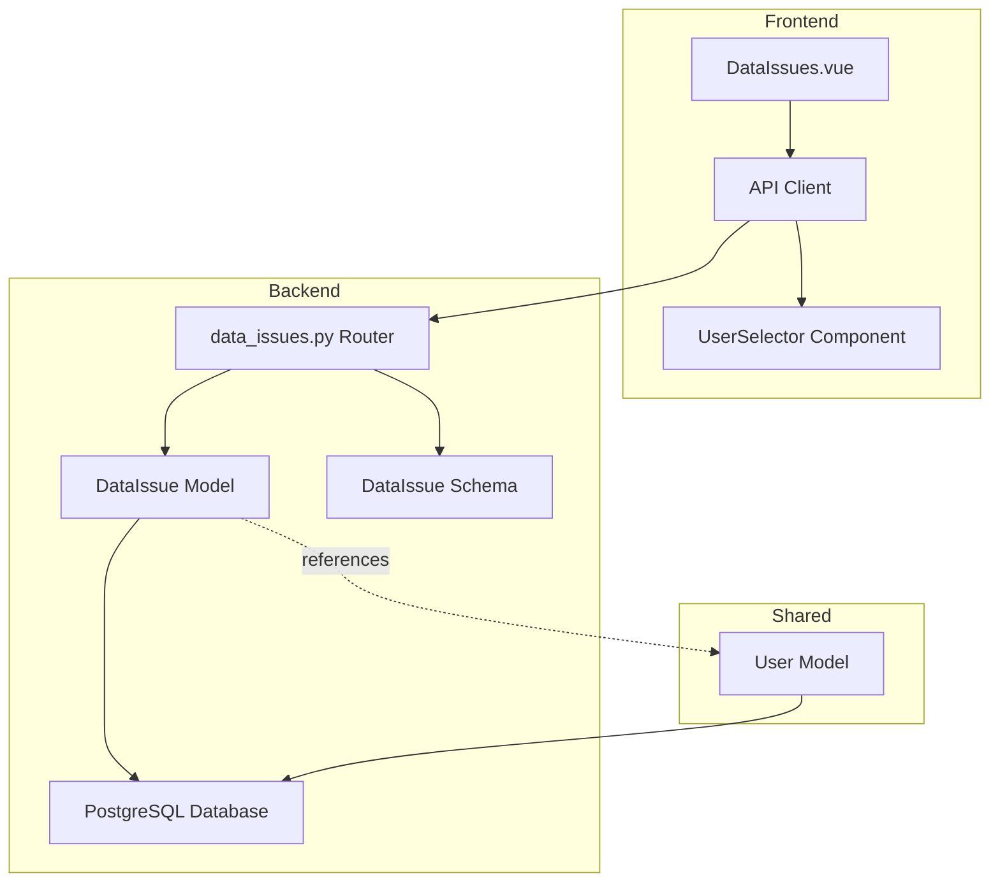
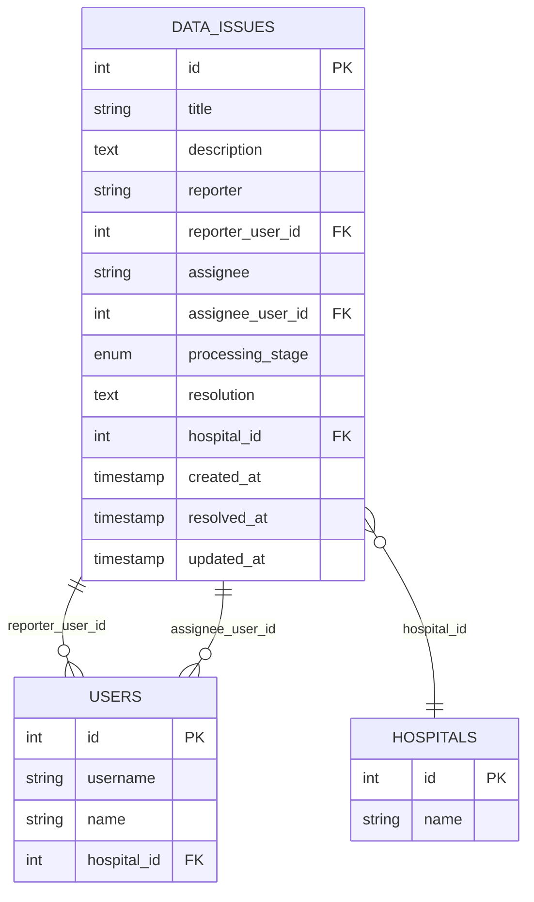

# Design Document - 数据问题记录功能

## Overview

数据问题记录功能是数据质量报告模块的子功能，用于数据工程师记录、跟踪和管理数据质量问题。该功能采用前后端分离架构，后端基于FastAPI + SQLAlchemy，前端基于Vue 3 + Element Plus，遵循现有系统的设计模式和代码规范。

### 技术栈
- **后端**: Python 3.x, FastAPI, SQLAlchemy, PostgreSQL
- **前端**: Vue 3, TypeScript, Element Plus, Pinia
- **架构模式**: RESTful API, MVC

## Architecture

### 系统架构图



### 模块关系
- 数据问题记录作为独立模块，通过外键关联用户表
- 前端通过二级菜单集成到数据质量报告下
- 用户选择器组件可复用于其他模块

## Components and Interfaces

### 1. 数据库模型 (Backend Model)

**文件**: `backend/app/models/data_issue.py`


```python
class ProcessingStage(str, enum.Enum):
    """处理阶段枚举"""
    NOT_STARTED = "not_started"      # 待开始
    IN_PROGRESS = "in_progress"      # 进行中
    RESOLVED = "resolved"            # 已解决
    CONFIRMED = "confirmed"          # 已确认

class DataIssue(Base):
    """数据问题记录模型"""
    __tablename__ = "data_issues"
    
    id = Column(Integer, primary_key=True, autoincrement=True)
    title = Column(String(200), nullable=False, comment="问题标题")
    description = Column(Text, nullable=False, comment="问题描述")
    reporter = Column(String(100), nullable=False, comment="记录人")
    reporter_user_id = Column(Integer, ForeignKey("users.id", ondelete="SET NULL"), nullable=True, comment="记录人用户ID")
    assignee = Column(String(100), nullable=True, comment="负责人")
    assignee_user_id = Column(Integer, ForeignKey("users.id", ondelete="SET NULL"), nullable=True, comment="负责人用户ID")
    processing_stage = Column(Enum(ProcessingStage), default=ProcessingStage.NOT_STARTED, nullable=False, comment="处理阶段")
    resolution = Column(Text, nullable=True, comment="解决方案")
    hospital_id = Column(Integer, ForeignKey("hospitals.id", ondelete="CASCADE"), nullable=False, comment="所属医疗机构ID")
    created_at = Column(DateTime, default=datetime.utcnow, nullable=False, comment="记录时间")
    resolved_at = Column(DateTime, nullable=True, comment="解决时间")
    updated_at = Column(DateTime, default=datetime.utcnow, onupdate=datetime.utcnow, nullable=False)
    
    # Relationships
    reporter_user = relationship("User", foreign_keys=[reporter_user_id])
    assignee_user = relationship("User", foreign_keys=[assignee_user_id])
    hospital = relationship("Hospital", back_populates="data_issues")
```

**设计说明**:
- 使用自增主键ID
- reporter和assignee字段存储显示名称（支持手动输入）
- reporter_user_id和assignee_user_id存储关联的用户ID（支持从系统用户选择）
- hospital_id实现多租户数据隔离
- resolved_at通过数据库触发器或应用层逻辑自动设置

### 2. API Schema (Backend)

**文件**: `backend/app/schemas/data_issue.py`

```python
class ProcessingStageEnum(str, Enum):
    NOT_STARTED = "not_started"
    IN_PROGRESS = "in_progress"
    RESOLVED = "resolved"
    CONFIRMED = "confirmed"

class DataIssueBase(BaseModel):
    title: str = Field(..., min_length=1, max_length=200)
    description: str = Field(..., min_length=1)
    reporter: str = Field(..., min_length=1, max_length=100)
    reporter_user_id: Optional[int] = None
    assignee: Optional[str] = Field(None, max_length=100)
    assignee_user_id: Optional[int] = None
    processing_stage: ProcessingStageEnum = ProcessingStageEnum.NOT_STARTED
    resolution: Optional[str] = None

class DataIssueCreate(DataIssueBase):
    pass

class DataIssueUpdate(BaseModel):
    title: Optional[str] = Field(None, min_length=1, max_length=200)
    description: Optional[str] = Field(None, min_length=1)
    reporter: Optional[str] = Field(None, min_length=1, max_length=100)
    reporter_user_id: Optional[int] = None
    assignee: Optional[str] = Field(None, max_length=100)
    assignee_user_id: Optional[int] = None
    processing_stage: Optional[ProcessingStageEnum] = None
    resolution: Optional[str] = None

class DataIssue(DataIssueBase):
    id: int
    hospital_id: int
    created_at: datetime
    resolved_at: Optional[datetime]
    updated_at: datetime
    
    class Config:
        from_attributes = True
```

### 3. API Endpoints (Backend)

**文件**: `backend/app/api/data_issues.py`


**RESTful API设计**:

| Method | Endpoint | Description | Auth Required |
|--------|----------|-------------|---------------|
| GET | `/api/data-issues` | 获取问题列表（分页、筛选） | Yes |
| POST | `/api/data-issues` | 创建新问题 | Yes |
| GET | `/api/data-issues/{id}` | 获取问题详情 | Yes |
| PUT | `/api/data-issues/{id}` | 更新问题 | Yes |
| DELETE | `/api/data-issues/{id}` | 删除问题 | Yes |

**查询参数**:
- `page`: 页码（默认1）
- `size`: 每页数量（默认20）
- `keyword`: 关键词搜索（标题、描述）
- `processing_stage`: 处理阶段筛选
- `reporter`: 记录人筛选
- `assignee`: 负责人筛选

**业务逻辑**:
1. 创建问题时自动设置hospital_id为当前用户所属医疗机构
2. 更新processing_stage为"resolved"时，自动设置resolved_at
3. processing_stage为"resolved"时，必须填写resolution
4. 查询时自动过滤当前用户可访问的医疗机构数据

### 4. 前端页面组件

**文件**: `frontend/src/views/DataIssues.vue`

**组件结构**:
```
DataIssues.vue
├── 搜索栏 (el-form)
│   ├── 关键词搜索
│   ├── 处理阶段筛选
│   └── 搜索/重置按钮
├── 数据表格 (el-table)
│   ├── ID列
│   ├── 标题列
│   ├── 记录人列
│   ├── 负责人列（显示"待定"如果为空）
│   ├── 处理阶段列（带标签颜色）
│   ├── 记录时间列
│   └── 操作列（编辑、删除）
├── 分页器 (el-pagination)
└── 新增/编辑对话框 (el-dialog)
    └── 表单 (el-form)
        ├── 标题（必填）
        ├── 问题描述（必填，多行文本）
        ├── 记录人（必填，UserSelector组件）
        ├── 负责人（可选，UserSelector组件）
        ├── 处理阶段（下拉选择，带提示）
        └── 解决方案（条件必填，多行文本）
```

**状态管理**:
- 使用Vue 3 Composition API
- 本地状态管理（ref, reactive）
- 复用现有的userStore和hospitalStore

### 5. 用户选择器组件

**文件**: `frontend/src/components/UserSelector.vue`

**功能特性**:
- 支持手动输入文本
- 支持从系统用户列表搜索选择
- 下拉列表显示用户名和姓名
- 选中后显示姓名，同时保存user_id

**组件接口**:
```typescript
interface Props {
  modelValue: string          // v-model绑定的显示值
  userId?: number | null      // 关联的用户ID
  placeholder?: string
  required?: boolean
}

interface Emits {
  'update:modelValue': (value: string) => void
  'update:userId': (value: number | null) => void
}
```

## Data Models

### 数据库表结构

**表名**: `data_issues`

| 字段名 | 类型 | 约束 | 说明 |
|--------|------|------|------|
| id | INTEGER | PRIMARY KEY, AUTO_INCREMENT | 问题ID |
| title | VARCHAR(200) | NOT NULL | 问题标题 |
| description | TEXT | NOT NULL | 问题描述 |
| reporter | VARCHAR(100) | NOT NULL | 记录人姓名 |
| reporter_user_id | INTEGER | FOREIGN KEY(users.id) | 记录人用户ID |
| assignee | VARCHAR(100) | NULL | 负责人姓名 |
| assignee_user_id | INTEGER | FOREIGN KEY(users.id) | 负责人用户ID |
| processing_stage | ENUM | NOT NULL, DEFAULT 'not_started' | 处理阶段 |
| resolution | TEXT | NULL | 解决方案 |
| hospital_id | INTEGER | NOT NULL, FOREIGN KEY(hospitals.id) | 所属医疗机构ID |
| created_at | TIMESTAMP | NOT NULL, DEFAULT CURRENT_TIMESTAMP | 记录时间 |
| resolved_at | TIMESTAMP | NULL | 解决时间 |
| updated_at | TIMESTAMP | NOT NULL, DEFAULT CURRENT_TIMESTAMP | 更新时间 |

**索引**:
- PRIMARY KEY: id
- INDEX: hospital_id
- INDEX: processing_stage
- INDEX: reporter_user_id
- INDEX: assignee_user_id
- INDEX: created_at


### 数据关系图



## Error Handling

### 后端错误处理

**验证错误**:
- 400 Bad Request: 必填字段缺失、字段格式错误
- 400 Bad Request: processing_stage为"resolved"但resolution为空

**权限错误**:
- 401 Unauthorized: 未登录
- 403 Forbidden: 无权访问其他医疗机构的数据

**资源错误**:
- 404 Not Found: 问题记录不存在
- 404 Not Found: 关联的用户不存在

**示例错误响应**:
```json
{
  "detail": "处理阶段为'已解决'时，必须填写解决方案"
}
```

### 前端错误处理

**表单验证**:
- 实时验证必填字段
- 提交前验证所有规则
- 显示友好的错误提示

**API错误处理**:
- 网络错误: 显示"网络连接失败"提示
- 服务器错误: 显示具体错误信息
- 超时错误: 显示"请求超时"提示

**用户体验**:
- 使用Element Plus的Message组件显示错误
- 表单验证失败时高亮错误字段
- 操作失败后保留用户输入的数据

## Testing Strategy

### 后端测试

**单元测试** (pytest):
1. 模型测试
   - 测试DataIssue模型的创建和字段验证
   - 测试ProcessingStage枚举值
   - 测试关系映射

2. API测试
   - 测试CRUD操作的正常流程
   - 测试分页和筛选功能
   - 测试必填字段验证
   - 测试processing_stage和resolution的联动验证
   - 测试resolved_at的自动设置
   - 测试多租户数据隔离

3. 权限测试
   - 测试未登录用户访问被拒绝
   - 测试用户只能访问自己医疗机构的数据

**测试文件**: `backend/test_data_issues.py`

### 前端测试

**组件测试** (Vitest + Vue Test Utils):
1. DataIssues.vue测试
   - 测试列表渲染
   - 测试搜索和筛选功能
   - 测试新增/编辑对话框
   - 测试表单验证
   - 测试删除确认

2. UserSelector.vue测试
   - 测试手动输入
   - 测试用户搜索
   - 测试用户选择
   - 测试v-model双向绑定

**测试文件**: 
- `frontend/tests/unit/views/DataIssues.spec.ts`
- `frontend/tests/unit/components/UserSelector.spec.ts`

### 集成测试

**端到端测试场景**:
1. 创建问题记录的完整流程
2. 更新问题状态并填写解决方案
3. 筛选和搜索问题记录
4. 删除问题记录

### 手动测试清单

- [ ] 创建问题时必填字段验证
- [ ] 记录人和负责人的手动输入
- [ ] 记录人和负责人的用户选择
- [ ] 负责人为空时显示"待定"
- [ ] 处理阶段切换到"已解决"时必须填写解决方案
- [ ] 解决时间自动记录
- [ ] 列表分页和排序
- [ ] 按处理阶段筛选
- [ ] 关键词搜索
- [ ] 编辑问题记录
- [ ] 删除问题记录
- [ ] 多租户数据隔离验证

## UI/UX Design

### 样式一致性原则

**重要**: 本模块的UI样式必须与系统其他模块保持完全一致，包括但不限于:
- 页面布局结构（el-card包裹）
- 间距规范（padding、margin）
- 字体大小和颜色
- 按钮样式和尺寸
- 表格样式和行高
- 表单标签宽度和对齐方式
- 对话框宽度和样式
- 分页器样式和位置

**参考模板**: 参照 `frontend/src/views/Users.vue` 的样式实现，确保视觉体验一致。

### 页面布局

**列表页面**:
- 外层: el-card包裹整个页面内容
- 卡片头部: 标题"数据问题记录" + 新建问题按钮（右对齐）
- 搜索栏: el-form inline布局，margin-bottom: 20px
- 表格: el-table，width: 100%
- 底部: el-pagination，margin-top: 20px，右对齐

**表单对话框**:
- 标题: "新增问题" / "编辑问题"
- 宽度: 600px（与Users.vue一致）
- 表单布局: 单列布局，label-width: 120px
- 按钮: 取消、确定（底部右对齐）

### 处理阶段颜色方案

| 阶段 | 颜色 | Element Plus Tag Type |
|------|------|----------------------|
| 待开始 | 灰色 | info |
| 进行中 | 蓝色 | primary |
| 已解决 | 绿色 | success |
| 已确认 | 深绿 | success (dark) |

### 提示信息

**处理阶段字段提示**:
```
问题的处理结果包括但不限于：技术修复、流程优化、数据更正等。
若经评估后决定不予处理或撤回问题，也应将处理阶段更新为"已解决"，
并在解决方案中详细说明不处理的原因和依据。
```

显示位置: 处理阶段下拉框下方，使用el-alert组件，type="info"

### 交互细节

1. **用户选择器交互**:
   - 点击输入框显示下拉列表
   - 输入文本时实时搜索用户
   - 选择用户后显示姓名
   - 可清除选择后手动输入

2. **表单验证反馈**:
   - 失焦时验证单个字段
   - 提交时验证所有字段
   - 错误信息显示在字段下方

3. **删除确认**:
   - 使用ElMessageBox.confirm
   - 显示问题标题
   - 确认后执行删除

4. **负责人显示**:
   - 列表中为空时显示"待定"（灰色文字）
   - 详情中为空时显示"-"

## Implementation Notes

### 数据库迁移

使用Alembic创建迁移脚本:
```bash
alembic revision -m "add_data_issues_table"
alembic upgrade head
```

### 路由注册

**后端** (`backend/app/main.py`):
```python
from app.api import data_issues
app.include_router(data_issues.router, prefix="/api/data-issues", tags=["data-issues"])
```

**前端** (`frontend/src/router/index.ts`):
```typescript
{
  path: '/data-issues',
  name: 'DataIssues',
  component: () => import('@/views/DataIssues.vue'),
  meta: { title: '数据问题记录' }
}
```

### 菜单集成

修改 `frontend/src/views/Layout.vue`，将"数据质量报告"改为子菜单:
```vue
<el-sub-menu index="data-quality">
  <template #title>
    <el-icon><DocumentChecked /></el-icon>
    <span>数据质量报告</span>
  </template>
  <el-menu-item index="/data-issues">数据问题记录</el-menu-item>
</el-sub-menu>
```

### API Client

**文件**: `frontend/src/api/dataIssue.ts`

```typescript
export interface DataIssue {
  id: number
  title: string
  description: string
  reporter: string
  reporter_user_id?: number
  assignee?: string
  assignee_user_id?: number
  processing_stage: 'not_started' | 'in_progress' | 'resolved' | 'confirmed'
  resolution?: string
  hospital_id: number
  created_at: string
  resolved_at?: string
  updated_at: string
}

export const getDataIssueList = (params: any) => request.get('/api/data-issues', { params })
export const createDataIssue = (data: any) => request.post('/api/data-issues', data)
export const getDataIssue = (id: number) => request.get(`/api/data-issues/${id}`)
export const updateDataIssue = (id: number, data: any) => request.put(`/api/data-issues/${id}`, data)
export const deleteDataIssue = (id: number) => request.delete(`/api/data-issues/${id}`)
```

### 依赖关系

**新增文件**:
- `backend/app/models/data_issue.py`
- `backend/app/schemas/data_issue.py`
- `backend/app/api/data_issues.py`
- `frontend/src/views/DataIssues.vue`
- `frontend/src/components/UserSelector.vue`
- `frontend/src/api/dataIssue.ts`

**修改文件**:
- `backend/app/models/__init__.py` (导入DataIssue)
- `backend/app/api/__init__.py` (导入data_issues)
- `backend/app/main.py` (注册路由)
- `frontend/src/router/index.ts` (添加路由)
- `frontend/src/views/Layout.vue` (修改菜单)

## Performance Considerations

1. **数据库查询优化**:
   - 在hospital_id、processing_stage、created_at上创建索引
   - 使用分页避免一次加载大量数据
   - 使用joinedload预加载关联的用户数据

2. **前端性能**:
   - 用户选择器使用防抖(debounce)优化搜索
   - 表格使用虚拟滚动（如果数据量大）
   - 合理使用v-if和v-show

3. **缓存策略**:
   - 用户列表可以缓存在前端（有效期5分钟）
   - 问题列表不缓存，保证数据实时性

## Security Considerations

1. **数据隔离**:
   - 所有查询自动过滤hospital_id
   - 管理员可以访问所有医疗机构数据
   - 普通用户只能访问自己医疗机构的数据

2. **输入验证**:
   - 后端使用Pydantic进行数据验证
   - 前端使用Element Plus表单验证
   - 防止SQL注入（使用ORM）
   - 防止XSS攻击（Vue自动转义）

3. **权限控制**:
   - 所有API需要登录认证
   - 使用JWT token进行身份验证
   - 删除操作需要二次确认

## Future Enhancements

1. **问题关联**:
   - 关联到具体的数据源或计算任务
   - 支持问题之间的关联（父子问题）

2. **通知功能**:
   - 问题分配时通知负责人
   - 问题解决时通知记录人

3. **统计分析**:
   - 问题趋势图表
   - 按类型、阶段统计
   - 平均解决时间分析

4. **附件支持**:
   - 上传问题相关的截图或文件
   - 支持多个附件

5. **评论功能**:
   - 支持对问题进行评论讨论
   - 记录问题处理过程

6. **导出功能**:
   - 导出问题列表为Excel
   - 生成问题报告
