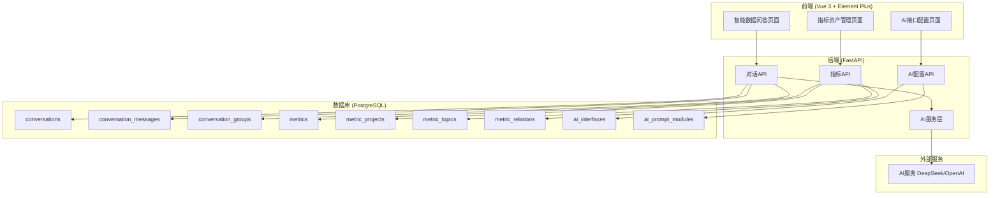
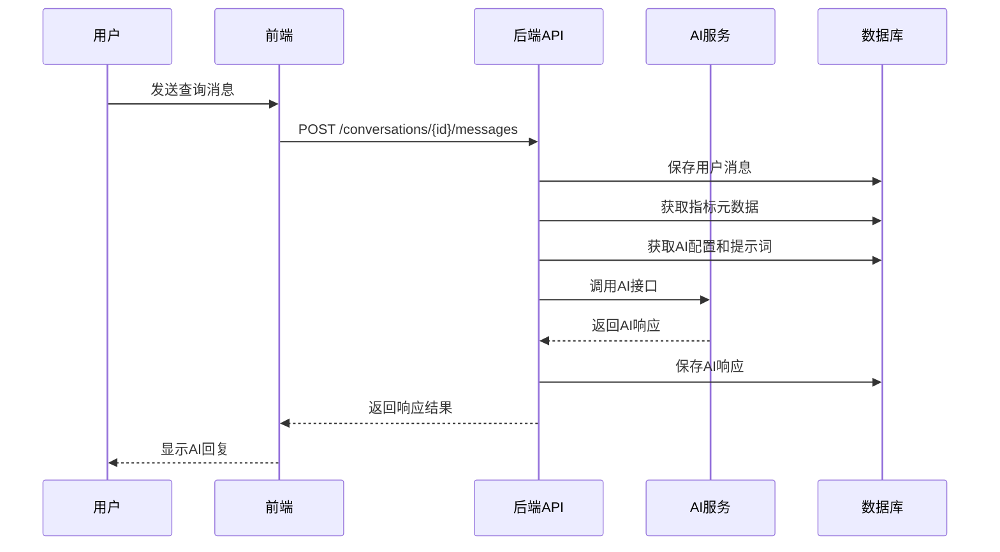
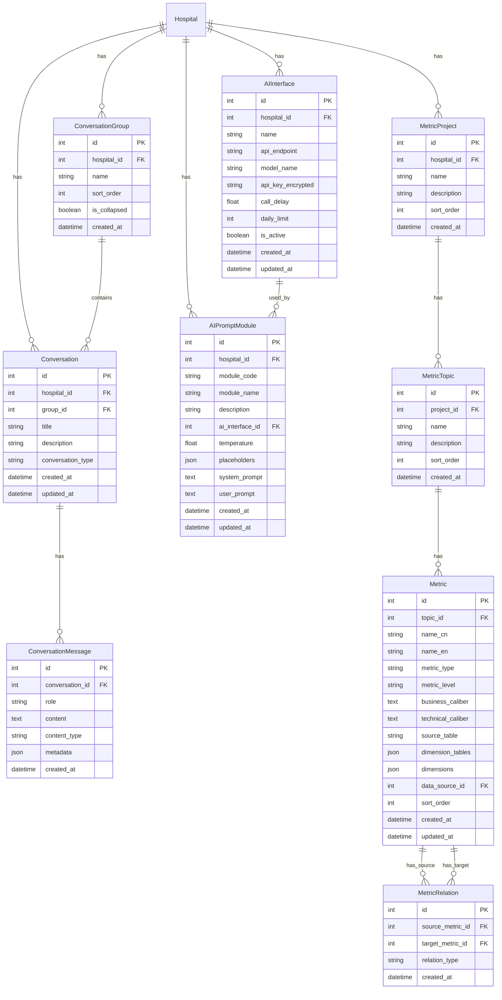

# 设计文档

## 概述

智能问数系统是一个基于AI的数据查询和分析模块，包含两个核心子模块：

1. **智能数据问答**：提供对话式数据查询界面，支持三种对话类型（指标口径查询、数据智能查询、SQL代码编写）
2. **指标资产管理**：管理指标的元数据和层级结构，为智能问答提供知识基础

系统还需要升级现有的AI接口配置，支持多AI接口管理和按模块配置提示词。

## 架构

### 系统架构图



### 模块交互流程



## 组件和接口

### 后端API接口

#### 1. 对话管理API (`/api/v1/conversations`)

| 方法 | 路径 | 描述 |
|------|------|------|
| GET | `/` | 获取对话列表（支持搜索、分页） |
| POST | `/` | 创建新对话 |
| GET | `/{id}` | 获取对话详情（含消息历史） |
| PUT | `/{id}` | 更新对话（标题、类型等） |
| DELETE | `/{id}` | 删除对话 |
| POST | `/{id}/messages` | 发送消息并获取AI回复 |

#### 2. 对话分组API (`/api/v1/conversation-groups`)

| 方法 | 路径 | 描述 |
|------|------|------|
| GET | `/` | 获取分组列表 |
| POST | `/` | 创建分组 |
| PUT | `/{id}` | 更新分组 |
| DELETE | `/{id}` | 删除分组 |
| PUT | `/{id}/conversations` | 批量移动对话到分组 |

#### 3. 指标资产API (`/api/v1/metrics`)

| 方法 | 路径 | 描述 |
|------|------|------|
| GET | `/tree` | 获取指标树结构 |
| GET | `/{id}` | 获取指标详情 |
| POST | `/` | 创建指标 |
| PUT | `/{id}` | 更新指标 |
| DELETE | `/{id}` | 删除指标 |
| GET | `/{id}/relations` | 获取指标关联 |
| POST | `/{id}/relations` | 添加指标关联 |
| DELETE | `/{id}/relations/{related_id}` | 删除指标关联 |
| GET | `/{id}/affected` | 获取受影响的指标列表 |

#### 4. 指标项目API (`/api/v1/metric-projects`)

| 方法 | 路径 | 描述 |
|------|------|------|
| GET | `/` | 获取项目列表 |
| POST | `/` | 创建项目 |
| PUT | `/{id}` | 更新项目 |
| DELETE | `/{id}` | 删除项目 |
| PUT | `/reorder` | 重新排序项目 |

#### 5. 指标主题API (`/api/v1/metric-topics`)

| 方法 | 路径 | 描述 |
|------|------|------|
| GET | `/` | 获取主题列表 |
| POST | `/` | 创建主题 |
| PUT | `/{id}` | 更新主题 |
| DELETE | `/{id}` | 删除主题 |
| PUT | `/reorder` | 重新排序主题 |

#### 6. AI接口配置API (`/api/v1/ai-interfaces`)

| 方法 | 路径 | 描述 |
|------|------|------|
| GET | `/` | 获取AI接口列表 |
| POST | `/` | 创建AI接口 |
| GET | `/{id}` | 获取AI接口详情 |
| PUT | `/{id}` | 更新AI接口 |
| DELETE | `/{id}` | 删除AI接口 |
| POST | `/{id}/test` | 测试AI接口连接 |

#### 7. 提示词模块API (`/api/v1/ai-prompt-modules`)

| 方法 | 路径 | 描述 |
|------|------|------|
| GET | `/` | 获取所有模块配置 |
| GET | `/{module_code}` | 获取指定模块配置 |
| PUT | `/{module_code}` | 更新模块配置 |

### 前端组件

#### 智能数据问答页面 (`SmartDataQA.vue`)

```
┌─────────────────────────────────────────────────────────────┐
│ 智能数据问答                                                  │
├──────────────┬──────────────────────────────────────────────┤
│ 搜索对话...   │ 对话标题 [编辑]                               │
│ [+ 新建对话]  │                                              │
│ [+ 新建分组]  │ ┌──────────────────────────────────────────┐ │
│              │ │ 用户: 查询门诊收入指标的口径               │ │
│ ▼ 分组1 (3)  │ │                                          │ │
│   对话1      │ │ AI: 找到以下相关指标：                    │ │
│   对话2      │ │ | 指标名称 | 口径定义 | 源表 |             │ │
│   对话3      │ │ | 门诊收入 | ... | ... |                  │ │
│              │ │ [下载 Markdown] [下载 PDF]                │ │
│ ▼ 分组2 (2)  │ └──────────────────────────────────────────┘ │
│   对话4      │                                              │
│   对话5      │ ┌──────────────────────────────────────────┐ │
│              │ │ 对话类型: ○指标口径查询 ○数据智能查询      │ │
│ 未分组       │ │          ○SQL代码编写                     │ │
│   对话6      │ │ [输入消息...]                    [发送]   │ │
│              │ └──────────────────────────────────────────┘ │
└──────────────┴──────────────────────────────────────────────┘
```

#### 指标资产管理页面 (`MetricAssets.vue`)

```
┌─────────────────────────────────────────────────────────────┐
│ 指标资产管理                                                  │
├──────────────┬──────────────────────────────────────────────┤
│ 指标树       │ 指标详情                                      │
│              │                                              │
│ ▼ 项目A      │ 业务属性                                      │
│   ▼ 主题1    │ ├─ 所属项目: 项目A                           │
│     指标1    │ ├─ 所属主题: 主题1                           │
│     指标2 ◄──│ └─ 业务口径: [文本框]                        │
│   ▼ 主题2    │                                              │
│     指标3    │ 指标属性                                      │
│              │ ├─ 中文名称: [文本框]                        │
│ ▼ 项目B      │ ├─ 英文名称: [文本框]                        │
│   ▼ 主题3    │ ├─ 指标类型: [原子指标/复合指标]             │
│     指标4    │ ├─ 指标层级: [文本框]                        │
│              │ ├─ 指标口径: [文本框]                        │
│ [+ 新建项目] │ ├─ 指标源表: [文本框]                        │
│              │ ├─ 关联维表: [多选]                          │
│              │ ├─ 指标维度: [多选]                          │
│              │ ├─ 关联指标: [多选]                          │
│              │ └─ 数据源: [下拉选择]                        │
│              │                                              │
│              │ [保存] [取消]                                 │
└──────────────┴──────────────────────────────────────────────┘
```

## 数据模型

### ER图



### 数据库表设计

#### 1. conversations（对话表）

| 字段 | 类型 | 约束 | 说明 |
|------|------|------|------|
| id | INTEGER | PK, AUTO | 主键 |
| hospital_id | INTEGER | FK, NOT NULL | 医疗机构ID |
| group_id | INTEGER | FK, NULL | 分组ID |
| title | VARCHAR(200) | NOT NULL | 对话标题 |
| description | VARCHAR(500) | NULL | 对话描述 |
| conversation_type | VARCHAR(50) | NOT NULL | 对话类型 |
| created_at | TIMESTAMP | NOT NULL | 创建时间 |
| updated_at | TIMESTAMP | NOT NULL | 更新时间 |

#### 2. conversation_groups（对话分组表）

| 字段 | 类型 | 约束 | 说明 |
|------|------|------|------|
| id | INTEGER | PK, AUTO | 主键 |
| hospital_id | INTEGER | FK, NOT NULL | 医疗机构ID |
| name | VARCHAR(100) | NOT NULL | 分组名称 |
| sort_order | INTEGER | NOT NULL | 排序顺序 |
| is_collapsed | BOOLEAN | DEFAULT FALSE | 是否收起 |
| created_at | TIMESTAMP | NOT NULL | 创建时间 |

#### 3. conversation_messages（对话消息表）

| 字段 | 类型 | 约束 | 说明 |
|------|------|------|------|
| id | INTEGER | PK, AUTO | 主键 |
| conversation_id | INTEGER | FK, NOT NULL | 对话ID |
| role | VARCHAR(20) | NOT NULL | 角色(user/assistant) |
| content | TEXT | NOT NULL | 消息内容 |
| content_type | VARCHAR(50) | NOT NULL | 内容类型 |
| metadata | JSONB | NULL | 元数据(图表配置等) |
| created_at | TIMESTAMP | NOT NULL | 创建时间 |

#### 4. metric_projects（指标项目表）

| 字段 | 类型 | 约束 | 说明 |
|------|------|------|------|
| id | INTEGER | PK, AUTO | 主键 |
| hospital_id | INTEGER | FK, NOT NULL | 医疗机构ID |
| name | VARCHAR(100) | NOT NULL | 项目名称 |
| description | VARCHAR(500) | NULL | 项目描述 |
| sort_order | INTEGER | NOT NULL | 排序顺序 |
| created_at | TIMESTAMP | NOT NULL | 创建时间 |
| updated_at | TIMESTAMP | NOT NULL | 更新时间 |

#### 5. metric_topics（指标主题表）

| 字段 | 类型 | 约束 | 说明 |
|------|------|------|------|
| id | INTEGER | PK, AUTO | 主键 |
| project_id | INTEGER | FK, NOT NULL | 项目ID |
| name | VARCHAR(100) | NOT NULL | 主题名称 |
| description | VARCHAR(500) | NULL | 主题描述 |
| sort_order | INTEGER | NOT NULL | 排序顺序 |
| created_at | TIMESTAMP | NOT NULL | 创建时间 |
| updated_at | TIMESTAMP | NOT NULL | 更新时间 |

#### 6. metrics（指标表）

| 字段 | 类型 | 约束 | 说明 |
|------|------|------|------|
| id | INTEGER | PK, AUTO | 主键 |
| topic_id | INTEGER | FK, NOT NULL | 主题ID |
| name_cn | VARCHAR(200) | NOT NULL | 中文名称 |
| name_en | VARCHAR(200) | NULL | 英文名称 |
| metric_type | VARCHAR(50) | NOT NULL | 指标类型 |
| metric_level | VARCHAR(100) | NULL | 指标层级 |
| business_caliber | TEXT | NULL | 业务口径 |
| technical_caliber | TEXT | NULL | 技术口径 |
| source_table | VARCHAR(200) | NULL | 源表 |
| dimension_tables | JSONB | NULL | 关联维表 |
| dimensions | JSONB | NULL | 指标维度 |
| data_source_id | INTEGER | FK, NULL | 数据源ID |
| sort_order | INTEGER | NOT NULL | 排序顺序 |
| created_at | TIMESTAMP | NOT NULL | 创建时间 |
| updated_at | TIMESTAMP | NOT NULL | 更新时间 |

#### 7. metric_relations（指标关联表）

| 字段 | 类型 | 约束 | 说明 |
|------|------|------|------|
| id | INTEGER | PK, AUTO | 主键 |
| source_metric_id | INTEGER | FK, NOT NULL | 源指标ID |
| target_metric_id | INTEGER | FK, NOT NULL | 目标指标ID |
| relation_type | VARCHAR(50) | NOT NULL | 关联类型 |
| created_at | TIMESTAMP | NOT NULL | 创建时间 |

#### 8. ai_interfaces（AI接口表）

| 字段 | 类型 | 约束 | 说明 |
|------|------|------|------|
| id | INTEGER | PK, AUTO | 主键 |
| hospital_id | INTEGER | FK, NOT NULL | 医疗机构ID |
| name | VARCHAR(100) | NOT NULL | 接口名称 |
| api_endpoint | VARCHAR(500) | NOT NULL | API端点 |
| model_name | VARCHAR(100) | NOT NULL | 模型名称 |
| api_key_encrypted | TEXT | NOT NULL | 加密的API密钥 |
| call_delay | FLOAT | DEFAULT 1.0 | 调用延迟 |
| daily_limit | INTEGER | DEFAULT 10000 | 每日限额 |
| is_active | BOOLEAN | DEFAULT TRUE | 是否启用 |
| created_at | TIMESTAMP | NOT NULL | 创建时间 |
| updated_at | TIMESTAMP | NOT NULL | 更新时间 |

#### 9. ai_prompt_modules（AI提示词模块表）

| 字段 | 类型 | 约束 | 说明 |
|------|------|------|------|
| id | INTEGER | PK, AUTO | 主键 |
| hospital_id | INTEGER | FK, NOT NULL | 医疗机构ID |
| module_code | VARCHAR(100) | NOT NULL | 模块代码 |
| module_name | VARCHAR(200) | NOT NULL | 模块名称 |
| description | TEXT | NULL | 模块描述 |
| ai_interface_id | INTEGER | FK, NULL | AI接口ID |
| temperature | FLOAT | DEFAULT 0.7 | 模型温度 |
| placeholders | JSONB | NOT NULL | 支持的占位符 |
| system_prompt | TEXT | NULL | 系统提示词 |
| user_prompt | TEXT | NOT NULL | 用户提示词 |
| created_at | TIMESTAMP | NOT NULL | 创建时间 |
| updated_at | TIMESTAMP | NOT NULL | 更新时间 |

### 模块代码常量

```python
class PromptModuleCode:
    """提示词模块代码常量"""
    # 智能分类分级
    CLASSIFICATION = "classification"
    
    # 业务价值报表
    REPORT_ISSUES = "report_issues"
    REPORT_PLANS = "report_plans"
    
    # 智能问数系统
    QUERY_CALIBER = "query_caliber"      # 指标口径查询
    QUERY_DATA = "query_data"            # 查询数据生成
    QUERY_SQL = "query_sql"              # SQL代码编写
```

## 正确性属性

*正确性属性是指在系统所有有效执行中都应保持为真的特征或行为——本质上是关于系统应该做什么的形式化陈述。属性作为人类可读规范和机器可验证正确性保证之间的桥梁。*

### 属性1：对话创建后列表长度增加

**对于任意**对话列表和有效的对话创建请求，创建对话后列表长度应增加1

**验证：需求 1.1**

### 属性2：对话搜索结果包含关键词

**对于任意**对话集合和搜索关键词，返回的所有对话的标题或描述都应包含该关键词

**验证：需求 1.2**

### 属性3：对话标题更新持久化

**对于任意**对话和新标题，更新后查询数据库应返回新标题

**验证：需求 1.4**

### 属性4：对话删除级联消息

**对于任意**对话，删除后该对话及其所有消息都不应存在于数据库中

**验证：需求 1.5**

### 属性5：分组删除后对话移至未分组

**对于任意**对话分组，删除后原分组内所有对话的group_id应为null

**验证：需求 2.5**

### 属性6：指标口径查询结果包含必需字段

**对于任意**指标口径查询结果，每条记录都应包含指标名称、口径定义、源表和相关维度字段

**验证：需求 3.2**

### 属性7：消息发送后持久化

**对于任意**用户消息，发送后应能在数据库中查询到该消息

**验证：需求 6.1**

### 属性8：指标树结构正确性

**对于任意**指标树，所有项目应为根节点（无父节点），所有主题应有项目父节点，所有指标应有主题父节点

**验证：需求 7.1**

### 属性9：节点排序持久化

**对于任意**同级节点重排序操作，更新后查询应返回新的排序顺序

**验证：需求 7.4**

### 属性10：节点删除级联子节点

**对于任意**项目或主题节点，删除后该节点及其所有子节点都不应存在于数据库中

**验证：需求 7.5**

### 属性11：指标必填字段验证

**对于任意**指标保存操作，如果缺少必填字段应返回验证错误

**验证：需求 8.4**

### 属性12：指标关联双向查询

**对于任意**指标关联关系，从源指标和目标指标都应能查询到该关联

**验证：需求 9.1, 9.2**

### 属性13：指标删除前检查关联

**对于任意**被其他指标关联的指标，删除前应返回受影响的指标列表

**验证：需求 9.4**

### 属性14：AI接口删除引用检查

**对于任意**被模块引用的AI接口，删除操作应返回错误

**验证：需求 10.4**

### 属性15：提示词模块配置完整性

**对于任意**提示词模块，查询应返回模块描述、AI接口、温度、占位符、系统提示词和用户提示词

**验证：需求 11.2**

### 属性16：未配置AI接口时阻止功能

**对于任意**未分配AI接口的模块，调用该模块功能应返回错误

**验证：需求 11.5**

## 错误处理

### 错误码定义

| 错误码 | HTTP状态码 | 描述 |
|--------|-----------|------|
| CONVERSATION_NOT_FOUND | 404 | 对话不存在 |
| GROUP_NOT_FOUND | 404 | 分组不存在 |
| METRIC_NOT_FOUND | 404 | 指标不存在 |
| PROJECT_NOT_FOUND | 404 | 项目不存在 |
| TOPIC_NOT_FOUND | 404 | 主题不存在 |
| AI_INTERFACE_NOT_FOUND | 404 | AI接口不存在 |
| AI_INTERFACE_IN_USE | 400 | AI接口被引用，无法删除 |
| AI_INTERFACE_NOT_CONFIGURED | 400 | 模块未配置AI接口 |
| AI_CONNECTION_ERROR | 503 | AI服务连接失败 |
| AI_RESPONSE_ERROR | 502 | AI响应解析失败 |
| METRIC_HAS_RELATIONS | 400 | 指标存在关联，需确认删除 |
| VALIDATION_ERROR | 422 | 数据验证失败 |
| PERMISSION_DENIED | 403 | 权限不足 |

### 错误响应格式

```json
{
  "code": 400,
  "message": "AI接口被引用，无法删除",
  "detail": {
    "error_code": "AI_INTERFACE_IN_USE",
    "referenced_by": ["智能分类分级", "指标口径查询"]
  }
}
```

## 测试策略

### 单元测试

使用 pytest 进行后端单元测试：

1. **模型测试**：验证数据模型的字段约束和关系
2. **服务层测试**：验证业务逻辑的正确性
3. **API测试**：验证接口的输入输出

### 属性测试

使用 hypothesis 库进行属性测试，验证正确性属性：

```python
from hypothesis import given, strategies as st

@given(st.text(min_size=1, max_size=200))
def test_conversation_search_contains_keyword(keyword):
    """属性2：对话搜索结果包含关键词"""
    # 创建包含关键词的对话
    # 执行搜索
    # 验证所有结果都包含关键词
    pass
```

### 集成测试

1. **API集成测试**：测试完整的API调用流程
2. **AI服务集成测试**：测试与AI服务的交互
3. **数据库集成测试**：测试数据持久化和查询

### 前端测试

使用 Vitest 进行前端组件测试：

1. **组件渲染测试**：验证组件正确渲染
2. **交互测试**：验证用户交互行为
3. **API调用测试**：验证API调用正确性

