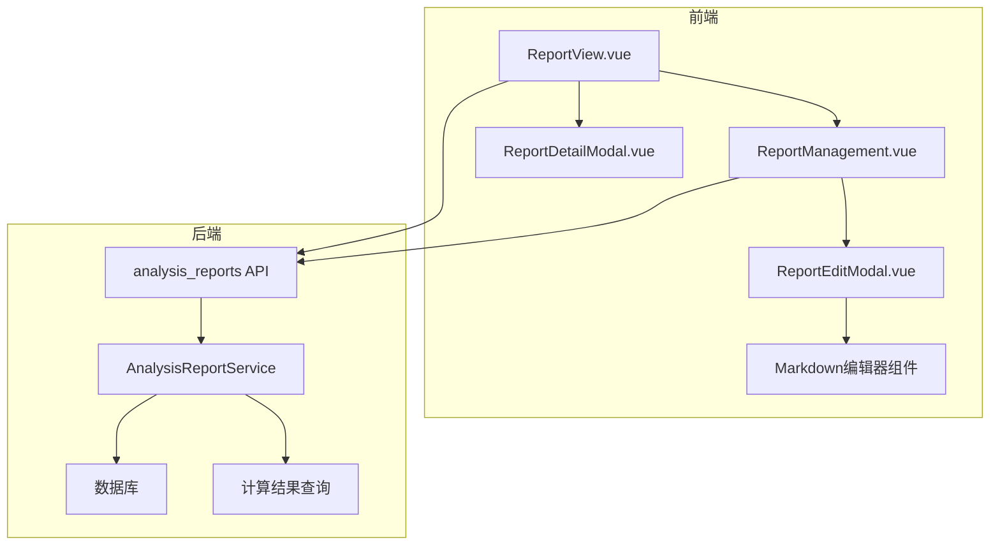

# 设计文档

## 概述

本设计文档描述了科室运营分析报告功能的技术实现方案。该功能允许用户查看和管理科室级别的业务价值分析报告，包括科室主业价值分布、业务内涵展示、当前问题分析和未来发展计划。

系统将基于现有的 `calculation_results` 表自动提取业务价值数据，并支持管理员通过可视化Markdown编辑器编辑报告的文本内容。

## 架构设计



### 技术栈

- **前端**: Vue 3 + Element Plus + TypeScript
- **后端**: FastAPI + SQLAlchemy
- **数据库**: PostgreSQL
- **Markdown编辑器**: md-editor-v3 (Vue 3 Markdown编辑器)

## 组件与接口

### 后端组件

#### 1. 数据模型 (Model)

**AnalysisReport** - 分析报告表
```python
class AnalysisReport(Base):
    __tablename__ = "analysis_reports"
    
    id: int                    # 主键
    hospital_id: int           # 医疗机构ID (多租户)
    department_id: int         # 科室ID (外键)
    period: str                # 年月 (YYYY-MM格式)
    current_issues: str        # 当前存在问题 (Markdown, 最大2000字符)
    future_plans: str          # 未来发展计划 (Markdown, 最大2000字符)
    created_at: datetime       # 创建时间
    updated_at: datetime       # 更新时间
    created_by: int            # 创建人ID
```

#### 2. API接口

| 方法 | 路径 | 描述 |
|------|------|------|
| GET | /api/v1/analysis-reports | 获取报告列表 |
| GET | /api/v1/analysis-reports/{id} | 获取报告详情 |
| GET | /api/v1/analysis-reports/{id}/value-distribution | 获取科室主业价值分布 |
| GET | /api/v1/analysis-reports/{id}/business-content | 获取科室业务内涵 |
| POST | /api/v1/analysis-reports | 创建报告 |
| PUT | /api/v1/analysis-reports/{id} | 更新报告 |
| DELETE | /api/v1/analysis-reports/{id} | 删除报告 |

#### 3. Schema定义

```python
class AnalysisReportBase(BaseModel):
    department_id: int
    period: str  # YYYY-MM
    current_issues: Optional[str] = Field(None, max_length=2000)
    future_plans: Optional[str] = Field(None, max_length=2000)

class AnalysisReportCreate(AnalysisReportBase):
    pass

class AnalysisReportUpdate(BaseModel):
    current_issues: Optional[str] = Field(None, max_length=2000)
    future_plans: Optional[str] = Field(None, max_length=2000)

class AnalysisReport(AnalysisReportBase):
    id: int
    hospital_id: int
    department_code: str
    department_name: str
    created_at: datetime
    updated_at: datetime

class ValueDistributionItem(BaseModel):
    rank: int              # 排名
    dimension_name: str    # 维度名称
    value: Decimal         # 业务价值
    ratio: Decimal         # 占比

class BusinessContentItem(BaseModel):
    rank: int              # 排名
    dimension_name: str    # 维度名称
    item_code: str         # 项目代码
    item_name: str         # 项目名称
    value: Decimal         # 业务价值
```

### 前端组件

#### 1. 页面组件

- **ReportView.vue** - 分析报告查看页面
- **ReportManagement.vue** - 分析报告管理页面
- **ReportDetailModal.vue** - 报告详情模态框（只读）
- **ReportEditModal.vue** - 报告编辑模态框（可编辑）

#### 2. API模块

```typescript
// api/analysis-reports.ts
export interface AnalysisReport {
  id: number
  hospital_id: number
  department_id: number
  department_code: string
  department_name: string
  period: string
  current_issues: string | null
  future_plans: string | null
  created_at: string
  updated_at: string
}

export interface ValueDistributionItem {
  rank: number           // 排名
  dimension_name: string // 维度名称
  value: number          // 业务价值
  ratio: number          // 占比
}

export interface BusinessContentItem {
  rank: number           // 排名
  dimension_name: string // 维度名称
  item_code: string      // 项目代码
  item_name: string      // 项目名称
  value: number          // 业务价值
}
```

## 数据模型

### 数据库表设计

```sql
CREATE TABLE analysis_reports (
    id SERIAL PRIMARY KEY,
    hospital_id INTEGER NOT NULL REFERENCES hospitals(id),
    department_id INTEGER NOT NULL REFERENCES departments(id),
    period VARCHAR(20) NOT NULL,
    current_issues TEXT,
    future_plans TEXT,
    created_at TIMESTAMP DEFAULT NOW(),
    updated_at TIMESTAMP DEFAULT NOW(),
    created_by INTEGER REFERENCES users(id),
    UNIQUE(hospital_id, department_id, period)
);

CREATE INDEX ix_analysis_reports_hospital_id ON analysis_reports(hospital_id);
CREATE INDEX ix_analysis_reports_department_id ON analysis_reports(department_id);
CREATE INDEX ix_analysis_reports_period ON analysis_reports(period);
```

### 数据查询逻辑

#### 科室主业价值分布 (Top 10维度)

```sql
SELECT 
    ROW_NUMBER() OVER (ORDER BY cr.value DESC) as rank,
    cr.node_name as dimension_name,
    cr.value,
    ROUND(cr.value * 100.0 / SUM(cr.value) OVER (), 2) as ratio
FROM calculation_results cr
INNER JOIN calculation_tasks ct ON cr.task_id = ct.task_id
WHERE cr.department_id = :department_id
  AND ct.period = :period
  AND ct.model_version_id IN (
      SELECT id FROM model_versions 
      WHERE hospital_id = :hospital_id AND is_active = true
  )
  AND cr.node_type = 'dimension'
ORDER BY cr.value DESC
LIMIT 10;
```

#### 科室业务内涵 (Top 20业务项目)

```sql
WITH top_dimensions AS (
    SELECT cr.node_id, cr.node_name
    FROM calculation_results cr
    INNER JOIN calculation_tasks ct ON cr.task_id = ct.task_id
    WHERE cr.department_id = :department_id
      AND ct.period = :period
      AND cr.node_type = 'dimension'
    ORDER BY cr.value DESC
    LIMIT 10
)
SELECT 
    ROW_NUMBER() OVER (ORDER BY cd.amount DESC) as rank,
    td.node_name as dimension_name,
    ci.item_code,
    ci.item_name,
    cd.amount as value
FROM charge_details cd
INNER JOIN dimension_item_mappings dim ON cd.item_code = dim.item_code
INNER JOIN top_dimensions td ON dim.node_id = td.node_id
INNER JOIN charge_items ci ON cd.item_code = ci.item_code
WHERE cd.department_id = :department_id
  AND cd.period = :period
ORDER BY cd.amount DESC
LIMIT 20;
```

## 正确性属性

*正确性属性是指在系统所有有效执行中都应保持为真的特征或行为——本质上是关于系统应该做什么的形式化陈述。属性是人类可读规范与机器可验证正确性保证之间的桥梁。*

### 属性 1: 多租户医疗机构隔离
*对于任意*报告查询操作（列表、获取、创建、更新、删除），所有数据访问都应按当前用户的 hospital_id 进行过滤，跨医疗机构访问应返回 403 错误。
**验证需求: 8.1, 8.2, 8.3, 8.4**

### 属性 2: 科室用户访问控制
*对于任意*科室用户（非管理员）访问报告，返回的列表应只包含 department_id 与用户所属科室匹配的报告，尝试访问其他科室的报告应被拒绝。
**验证需求: 3.1, 3.2, 3.3**

### 属性 3: 列表查询操作
*对于任意*带有排序或筛选参数的报告列表查询，返回结果应按指定字段正确排序，并按指定条件（年月、科室代码、科室名称）正确过滤。
**验证需求: 2.2, 2.3, 2.4, 2.5, 2.6, 2.7**

### 属性 4: 价值分布数据提取
*对于任意*给定科室和年月的价值分布查询，返回的项目应恰好是按业务价值降序排列的前10个维度，排名从1开始连续递增，每个项目应包含 dimension_name 和 value 字段。
**验证需求: 4.3, 7.1, 7.4**

### 属性 5: 业务内涵数据提取
*对于任意*给定科室和年月的业务内涵查询，返回的项目不应超过20个，应对应按价值排序的前10个维度，每个项目应包含 item_name、item_code、dimension_name 和 value 字段。
**验证需求: 4.4, 7.2, 7.5**

### 属性 6: Markdown内容长度验证
*对于任意*报告创建或更新操作，如果 current_issues 或 future_plans 内容超过2000字符，操作应被拒绝并返回验证错误。
**验证需求: 6.5, 6.6**

### 属性 7: 报告唯一性约束
*对于任意* hospital_id、department_id 和 period 组合，数据库中最多只能有一条报告记录。尝试创建重复记录应被拒绝。
**验证需求: 5.1**

### 属性 8: 分页行为
*对于任意*分页报告列表查询，默认每页数量应为20，更改每页数量应重置到第1页，应用筛选条件应重置到第1页，总数在翻页过程中应保持一致。
**验证需求: 9.1, 9.2, 9.3, 9.4**

### 属性 9: 报告删除一致性
*对于任意*报告删除操作，成功删除后，该报告应不再存在于数据库中，后续查询不应返回该报告。
**验证需求: 5.5**

## 错误处理

### 后端错误处理

| 错误场景 | HTTP状态码 | 错误消息 |
|---------|-----------|---------|
| 报告不存在 | 404 | "分析报告不存在或不属于当前医疗机构" |
| 无权访问其他科室报告 | 403 | "无权访问该科室的分析报告" |
| 重复创建报告 | 400 | "该科室在该月份的分析报告已存在" |
| Markdown内容超长 | 400 | "内容长度不能超过2000字符" |
| 无计算结果数据 | 200 | 返回空列表，前端显示"暂无数据" |

### 前端错误处理

- 网络错误：显示重试按钮
- 权限错误：显示无权限提示
- 数据为空：显示友好的空状态提示

## 测试策略

### 单元测试

1. **Schema验证测试**
   - 测试Markdown内容长度验证
   - 测试period格式验证
   - 测试必填字段验证

2. **服务层测试**
   - 测试报告CRUD操作
   - 测试价值分布查询逻辑
   - 测试业务内涵查询逻辑

### 属性测试

使用 `hypothesis` 库进行属性测试：

1. **属性1测试**: 生成随机hospital_id，验证查询结果只包含该hospital的数据
2. **属性2测试**: 生成随机department用户，验证只能访问自己科室的报告
3. **属性6测试**: 生成随机长度字符串，验证超过2000字符时被拒绝

### 集成测试

1. 测试完整的报告创建-查看-编辑-删除流程
2. 测试科室用户权限隔离
3. 测试多租户数据隔离

## 前端实现细节

### 菜单配置

```typescript
// menus.ts
{
  name: '运营分析报告',
  icon: 'DataAnalysis',
  children: [
    { name: '分析报告查看', path: '/report-view' },
    { name: '分析报告管理', path: '/report-management' }
  ]
}
```

### Markdown编辑器集成

使用 `md-editor-v3` 组件：

```vue
<template>
  <MdEditor 
    v-model="content" 
    :maxLength="2000"
    :toolbars="toolbars"
    language="zh-CN"
  />
</template>
```

### 权限控制

- 分析报告查看：所有用户可访问，科室用户只能看自己科室
- 分析报告管理：仅管理员可访问
