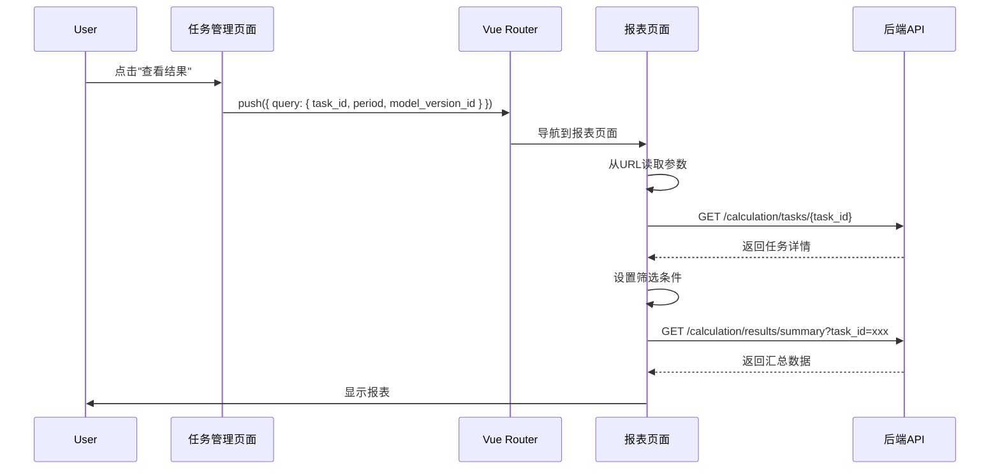
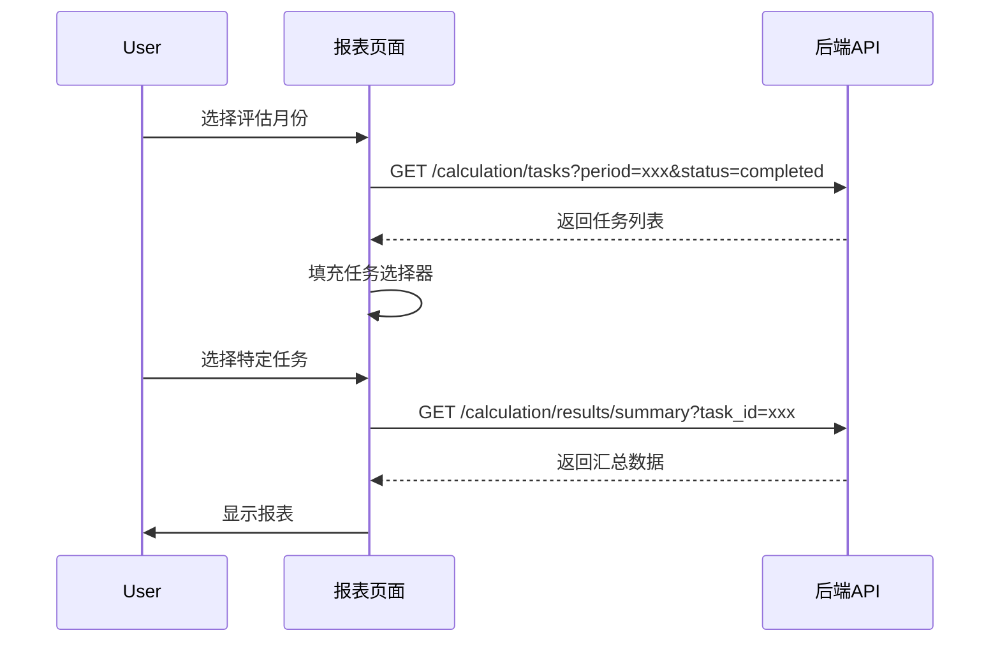
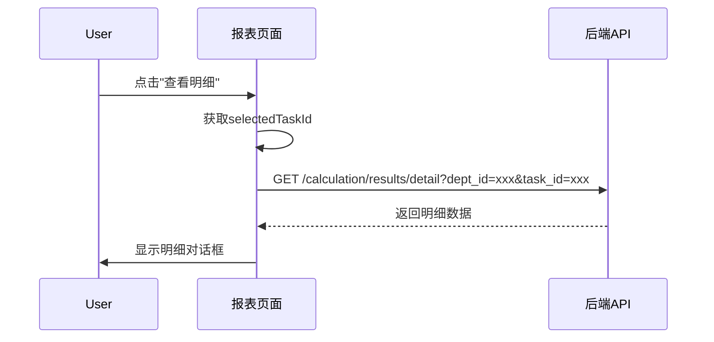

# 设计文档

## 概述

本功能通过在报表页面添加任务选择器，并增强任务管理页面的跳转能力，实现了更灵活的报表查看方式。用户可以选择特定的计算任务查看结果，也可以从任务管理页面直接跳转到对应任务的报表。

## 架构

### 系统组件

```
┌─────────────────────────────────────────────────────────────┐
│                      前端应用层                              │
├─────────────────────────────────────────────────────────────┤
│  CalculationTasks.vue          Results.vue                  │
│  (任务管理页面)                 (报表页面)                   │
│  - 任务列表展示                 - 任务选择器                 │
│  - 查看结果按钮                 - 汇总表展示                 │
│  - 跳转到报表                   - 明细查看                   │
│                                 - 导出功能                   │
└─────────────────────────────────────────────────────────────┘
                            ↓ HTTP
┌─────────────────────────────────────────────────────────────┐
│                      后端API层                               │
├─────────────────────────────────────────────────────────────┤
│  /calculation/tasks (GET)                                   │
│  - 支持period和model_version_id筛选                         │
│  - 支持status筛选（仅返回completed）                        │
│  - 应用医疗机构隔离                                          │
│                                                              │
│  /calculation/tasks/{task_id} (GET)                         │
│  - 获取任务详情                                              │
│  - 验证医疗机构权限                                          │
│                                                              │
│  /calculation/results/summary (GET)                         │
│  - 支持task_id参数（新增）                                   │
│  - 兼容原有period + model_version_id方式                    │
│                                                              │
│  /calculation/results/detail (GET)                          │
│  - 使用task_id参数                                           │
│                                                              │
│  /calculation/results/export/* (GET)                        │
│  - 使用task_id参数                                           │
└─────────────────────────────────────────────────────────────┘
                            ↓
┌─────────────────────────────────────────────────────────────┐
│                      数据库层                                │
├─────────────────────────────────────────────────────────────┤
│  calculation_tasks                                          │
│  - task_id (PK)                                             │
│  - model_version_id (FK)                                    │
│  - period                                                   │
│  - status                                                   │
│  - completed_at                                             │
│                                                              │
│  calculation_results                                        │
│  - task_id (FK)                                             │
│  - department_id                                            │
│  - node_id                                                  │
│  - value                                                    │
└─────────────────────────────────────────────────────────────┘
```

## 组件和接口

### 前端组件

#### 1. Results.vue（报表页面）

**新增状态变量：**
```typescript
const selectedTaskId = ref<string | null>(null)  // 当前选中的任务ID
const availableTasks = ref<any[]>([])            // 可选任务列表
const loadingTasks = ref(false)                  // 任务列表加载状态
```

**新增方法：**
```typescript
// 加载可选任务列表
async function loadAvailableTasks(): Promise<void>

// 处理任务选择变化
function onTaskChange(taskId: string): void

// 从URL参数初始化任务
function initFromUrlParams(): void
```

**修改方法：**
```typescript
// loadSummary: 支持使用task_id或period+version
// viewDetail: 使用selectedTaskId
// exportDetail: 使用selectedTaskId
```

**UI变更：**
- 在筛选条件区域添加任务选择器（el-select）
- 任务选择器显示格式：`任务ID (创建时间)`
- 默认选项：`最新任务`

#### 2. CalculationTasks.vue（任务管理页面）

**修改方法：**
```typescript
// viewResults: 传递task_id、period、model_version_id到报表页面
function viewResults(task: any): void {
  router.push({
    name: 'Results',
    query: {
      task_id: task.task_id,
      period: task.period,
      model_version_id: task.model_version_id
    }
  })
}
```

### 后端API

#### 1. GET /calculation/tasks

**现有参数：**
- page: int
- size: int
- status: Optional[str]
- model_version_id: Optional[int]

**新增参数：**
- period: Optional[str] - 评估月份筛选

**响应示例：**
```json
{
  "total": 10,
  "items": [
    {
      "task_id": "uuid-string",
      "model_version_id": 1,
      "workflow_id": 2,
      "period": "2025-11",
      "status": "completed",
      "progress": 100,
      "created_at": "2025-11-20T10:00:00",
      "completed_at": "2025-11-20T10:30:00"
    }
  ]
}
```

#### 2. GET /calculation/results/summary

**现有参数：**
- period: str (required)
- model_version_id: Optional[int]
- department_id: Optional[int]

**新增参数：**
- task_id: Optional[str] - 直接指定任务ID

**逻辑变更：**
```python
if task_id:
    # 使用指定的任务ID
    task = _get_task_with_hospital_check(db, task_id)
else:
    # 使用原有逻辑：查找最新完成任务
    task = _get_latest_completed_task(db, period, model_version_id)
```

#### 3. GET /calculation/results/detail

**参数保持不变：**
- dept_id: int (required)
- task_id: str (required)

#### 4. GET /calculation/results/export/detail

**参数保持不变：**
- task_id: str (required)

## 数据模型

### 前端类型定义

```typescript
// 任务选项
interface TaskOption {
  task_id: string
  label: string          // 显示文本：任务ID (创建时间)
  period: string
  model_version_id: number
  created_at: string
  completed_at: string
}

// 筛选表单
interface FilterForm {
  period: string
  model_version_id: number | null
  task_id: string | null  // 新增
}
```

### 后端Schema

无需新增Schema，使用现有的：
- CalculationTaskResponse
- CalculationTaskListResponse
- SummaryListResponse

## 交互流程

### 流程1：从任务管理页面跳转



### 流程2：在报表页面选择任务



### 流程3：查看明细



## 错误处理

### 前端错误处理

1. **缺少任务ID**
   - 场景：查看明细或导出时没有选中任务
   - 处理：显示警告消息"缺少任务ID，无法执行操作"

2. **任务不存在**
   - 场景：URL中的task_id无效
   - 处理：显示错误消息，清除task_id参数，回退到默认逻辑

3. **任务列表加载失败**
   - 场景：网络错误或权限问题
   - 处理：显示错误消息，禁用任务选择器

4. **跨医疗机构访问**
   - 场景：任务不属于当前激活的医疗机构
   - 处理：后端返回403，前端显示"无权访问该任务"

### 后端错误处理

1. **任务不存在（404）**
   ```python
   if not task:
       raise HTTPException(status_code=404, detail="任务不存在")
   ```

2. **无权访问（403）**
   ```python
   # 在apply_hospital_filter中自动处理
   query = apply_hospital_filter(query, ModelVersion, required=True)
   ```

3. **参数冲突（400）**
   ```python
   if task_id and (period or model_version_id):
       raise HTTPException(
           status_code=400, 
           detail="不能同时指定task_id和period/model_version_id"
       )
   ```

## 测试策略

### 单元测试

#### 前端测试
1. **任务选择器组件**
   - 测试任务列表加载
   - 测试任务选择事件
   - 测试默认选项显示

2. **URL参数处理**
   - 测试从URL初始化
   - 测试参数变化时的行为
   - 测试参数清除逻辑

#### 后端测试
1. **任务列表API**
   - 测试period筛选
   - 测试status筛选
   - 测试医疗机构隔离

2. **汇总数据API**
   - 测试task_id参数
   - 测试参数优先级
   - 测试错误处理

### 集成测试

1. **跨页面跳转**
   - 从任务管理页面跳转到报表
   - 验证参数正确传递
   - 验证数据正确加载

2. **任务切换**
   - 在报表页面切换任务
   - 验证汇总表更新
   - 验证明细查看使用正确任务

3. **导出功能**
   - 验证导出使用正确任务ID
   - 验证文件名包含任务信息

### 端到端测试

1. **完整工作流**
   - 创建计算任务
   - 等待任务完成
   - 从任务管理页面查看结果
   - 在报表页面切换任务
   - 查看明细
   - 导出报表

2. **多租户场景**
   - 切换医疗机构
   - 验证任务列表隔离
   - 验证跨机构访问被拒绝

## 性能考虑

### 前端优化

1. **任务列表缓存**
   - 缓存已加载的任务列表
   - 仅在筛选条件变化时重新加载

2. **防抖处理**
   - 任务选择器输入防抖
   - 避免频繁API调用

3. **懒加载**
   - 任务列表分页加载
   - 仅加载可见范围的任务

### 后端优化

1. **查询优化**
   - 添加索引：(period, status, hospital_id)
   - 使用JOIN避免N+1查询

2. **缓存策略**
   - 缓存已完成任务的结果
   - 使用Redis缓存热点数据

3. **分页限制**
   - 任务列表默认返回最近100条
   - 避免一次性加载过多数据

## 安全考虑

### 权限验证

1. **医疗机构隔离**
   - 所有API强制应用hospital_id过滤
   - 验证任务所属医疗机构

2. **任务访问控制**
   - 验证用户是否有权访问任务
   - 验证任务状态是否允许查看

### 数据验证

1. **参数验证**
   - 验证task_id格式（UUID）
   - 验证period格式（YYYY-MM）
   - 验证model_version_id存在性

2. **SQL注入防护**
   - 使用参数化查询
   - 避免字符串拼接SQL

## 兼容性

### 向后兼容

1. **API兼容性**
   - task_id参数为可选
   - 保留原有period + model_version_id逻辑
   - 不影响现有调用方式

2. **URL参数兼容**
   - 支持无task_id的URL
   - 支持仅有period的URL
   - 自动回退到默认行为

### 数据库兼容

- 无需数据库迁移
- 使用现有表结构
- 仅添加查询参数

## 部署注意事项

### 前端部署

1. **环境变量**
   - 无需新增环境变量

2. **构建配置**
   - 无需修改构建配置

### 后端部署

1. **数据库索引**
   ```sql
   CREATE INDEX idx_calculation_tasks_period_status 
   ON calculation_tasks(period, status, model_version_id);
   ```

2. **API版本**
   - 无需版本升级
   - 向后兼容现有客户端

### 回滚计划

1. **前端回滚**
   - 移除任务选择器UI
   - 恢复原有筛选逻辑

2. **后端回滚**
   - 移除task_id参数支持
   - 保留原有API逻辑

## 监控和日志

### 前端监控

1. **用户行为追踪**
   - 任务选择频率
   - 跳转来源统计
   - 错误发生率

2. **性能监控**
   - 任务列表加载时间
   - 报表渲染时间

### 后端监控

1. **API性能**
   - 任务列表查询时间
   - 汇总数据查询时间
   - 慢查询告警

2. **错误监控**
   - 404错误率
   - 403错误率
   - 500错误率

### 日志记录

1. **关键操作日志**
   - 任务选择操作
   - 跨页面跳转
   - 导出操作

2. **错误日志**
   - 任务不存在
   - 权限验证失败
   - 数据加载失败
