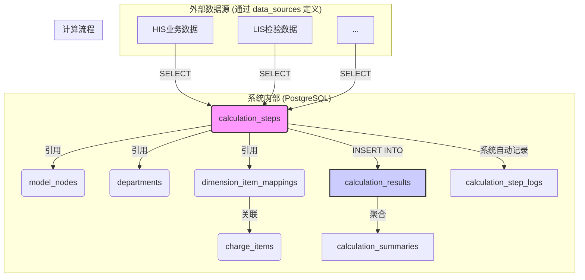

# 医院科室业务价值评估计算流程实现说明

## 1. 引言

本文档旨在为第三方SQL开发工程师提供详细的开发指南，用于实现医院科室业务价值评估的核心计算流程。请在开发前仔细阅读本文档，以确保对系统的数据结构、计算逻辑和开发要求有清晰的理解。

计算的核心任务是：根据系统内置的模型和规则，从外部数据源（如HIS、LIS等）提取业务数据，经过计算后，将结果填入指定的系统结果表中。

## 2. 核心概念

本系统的计算引擎遵循**“模型与逻辑分离”**的设计原则：

- **模型 (`model_nodes`)**: 定义了业务价值评估的“是什么”，即评估的层级结构、节点名称、权重等。
- **计算流程 (`calculation_steps`)**: 定义了“如何计算”，即获取每个模型节点数据的具体SQL代码。

您作为SQL工程师，主要工作是编写并维护 `calculation_steps` 表中的SQL代码。

## 3. 基础数据表说明（供计算引用）

本章节详细介绍在编写SQL时可以引用的系统内部基础数据表。

### 3.1. `departments` - 科室信息表

该表定义了所有科室的基础信息，以及它们是否参与业务价值评估。在最终结果展示时，系统会遍历该表中 `is_active = TRUE` 的所有科室。

| 字段名 | 类型 | 描述 |
|---|---|---|
| `id` | INTEGER | 科室的系统内部唯一ID。 |
| `hospital_id` | INTEGER | 所属医疗机构ID。 |
| `sort_order` | NUMERIC(10, 2) | 排序序号，用于前端展示排序。 |
| `his_code` | VARCHAR(50) | HIS系统中的科室代码，是与业务数据关联的关键。 |
| `his_name` | VARCHAR(100) | HIS系统中的科室名称。 |
| `cost_center_code` | VARCHAR(50) | 成本中心代码。 |
| `cost_center_name` | VARCHAR(100) | 成本中心名称。 |
| `accounting_unit_code`| VARCHAR(50) | 核算单元代码。 |
| `accounting_unit_name`| VARCHAR(100) | 核算单元名称。 |
| `is_active` | BOOLEAN | 标记该科室是否参与计算。 |
| `created_at` | DATETIME | 创建时间。 |
| `updated_at` | DATETIME | 更新时间。 |

### 3.2. `model_nodes` - 模型节点表

该表存储了业务价值评估模型的完整树状结构，是计算的核心依据。

| 字段名 | 类型 | 描述 |
|---|---|---|
| `id` | INTEGER | 节点的系统内部唯一ID。 |
| `version_id` | INT | 关联的 `model_versions` 表ID。 |
| `parent_id` | INT | 父节点ID，用于构建树状结构。 |
| `sort_order` | NUMERIC(10, 2) | 排序序号。 |
| `name` | VARCHAR(100) | 节点名称，如“医生序列”、“门诊工作量”。 |
| `code` | VARCHAR(50) | 节点编码，系统内唯一。 |
| `node_type` | VARCHAR(20) | 节点类型，`sequence` (序列) 或 `dimension` (维度)。 |
| `is_leaf` | BOOLEAN | 是否为末级维度。 |
| `calc_type` | VARCHAR(20) | 算法类型，`statistical` (指标) 或 `calculational` (目录)。 |
| `weight` | NUMERIC(10, 4) | 权重或单价，用于计算价值。 |
| `unit` | VARCHAR(20) | 单位，默认为 '%'。 |
| `business_guide` | TEXT | 业务导向说明。 |
| `rule` | TEXT | 规则的自然语言描述。 |
| `created_at` | DATETIME | 创建时间。 |
| `updated_at` | DATETIME | 更新时间。 |

### 3.3. `calculation_steps` - 计算步骤表

该表是SQL工程师工作的核心，定义了每个计算步骤的具体执行逻辑。

| 关键字段 | 类型 | 描述 |
|---|---|---|
| `id` | INTEGER | 步骤的系统内部唯一ID。 |
| `workflow_id` | INT | 关联的 `calculation_workflows` 表ID。 |
| `name` | VARCHAR | 步骤名称，通常与模型节点对应。 |
| `code_type` | VARCHAR | 代码类型，目前固定为 `sql`。 |
| `code_content` | TEXT | **您需要编写的SQL代码存放于此。** |
| `data_source_id` | INT | SQL执行的目标数据源ID，关联 `data_sources` 表。 |
| `sort_order` | NUMERIC | 执行顺序，系统按此字段从小到大执行。 |
| `is_enabled` | BOOLEAN | 标记该步骤是否执行。 |

### 3.4. `dimension_item_mappings` - 维度-收费项目映射表

对于“指标型”(`statistical`)的维度，该表定义了维度包含哪些具体的收费项目。

| 关键字段 | 类型 | 描述 |
|---|---|---|
| `dimension_id` | INT | 关联的 `model_nodes` 表ID。 |
| `item_code` | VARCHAR | 关联的 `charge_items` 表中的收费项目编码。 |

### 3.5. `charge_items` - 收费项目表

系统内维护的收费项目字典表。

| 字段名 | 类型 | 描述 |
|---|---|---|
| `id` | INTEGER | 主键ID。 |
| `hospital_id` | INTEGER | 所属医疗机构ID。 |
| `item_code` | VARCHAR(100) | 收费项目编码。 |
| `item_name` | VARCHAR(255) | 收费项目名称。 |
| `item_category` | VARCHAR(100) | 收费项目分类。 |
| `unit_price` | VARCHAR(50) | 单价。 |
| `created_at` | DATETIME | 创建时间。 |
| `updated_at` | DATETIME | 更新时间。 |

### 3.6. `data_sources` - 数据源配置表

该表存储了所有外部数据库的连接信息。

| 字段名 | 类型 | 描述 |
|---|---|---|
| `id` | INTEGER | 数据源的系统内部唯一ID。 |
| `name` | VARCHAR(100) | 数据源名称，如“HIS业务库”、“LIS检验库”。 |
| `db_type` | VARCHAR(20) | 数据库类型，如 `postgresql`, `sqlserver`。 |
| `host` | VARCHAR(255) | 主机地址。 |
| `port` | INTEGER | 端口号。 |
| `database_name` | VARCHAR(100) | 数据库名称。 |
| `username` | VARCHAR(100) | 用户名。 |
| `password` | TEXT | 密码（加密存储，您无需关心）。 |
| `schema_name` | VARCHAR(100) | Schema名称（可选）。 |
| `connection_params` | JSON | 额外连接参数（可选）。 |
| `is_default` | BOOLEAN | 是否为默认数据源。 |
| `is_enabled` | BOOLEAN | 是否启用。 |
| `description` | TEXT | 描述。 |
| `pool_size_min` | INTEGER | 连接池最小连接数。 |
| `pool_size_max` | INTEGER | 连接池最大连接数。 |
| `pool_timeout` | INTEGER | 连接超时时间(秒)。 |
| `created_at` | TIMESTAMP | 创建时间。 |
| `updated_at` | TIMESTAMP | 更新时间。 |

## 4. 结果数据表说明（供计算填充）

本章节详细介绍需要通过SQL计算流程最终填充的目标结果表。您的SQL脚本需要将计算结果 `INSERT` 或 `UPDATE` 到这些表中。

### 4.1. `calculation_results` - 计算结果明细表 (核心)

**这是最重要、最核心的结果表**。每个计算步骤都应将其最终计算结果写入此表。

| 字段名 | 类型 | 是否必须填充 | 描述 |
|---|---|---|---|
| `id` | INTEGER | 否 (自动生成) | 主键。 |
| `task_id` | VARCHAR(100) | **是** | 当前计算任务的ID，从 `{task_id}` 参数获取。 |
| `department_id` | INTEGER | **是** | 科室ID，从 `{department_id}` 参数获取或通过 `departments` 表关联。 |
| `node_id` | INTEGER | **是** | 结果对应的模型节点ID，需要您在SQL中指定。 |
| `node_name` | VARCHAR(255) | **是** | 模型节点名称，为方便调试和查询，必须填充。 |
| `node_code` | VARCHAR(100) | 否 | 模型节点编码，为方便调试和查询，建议填充。 |
| `node_type` | VARCHAR(50) | 否 | 模型节点类型，建议填充。 |
| `parent_id` | INTEGER | 否 | 父节点ID，建议填充。 |
| `workload` | DECIMAL(20, 4) | 否 | 工作量。例如手术次数、门诊人次等。 |
| `weight` | DECIMAL(10, 4) | 否 | 权重/单价。例如手术难度系数、项目单价等。 |
| `value` | DECIMAL(20, 4) | **是** | **业务价值**。这是最重要的计算结果。 |
| `ratio` | DECIMAL(10, 4) | 否 | 占比。通常是某个维度占其父节点的价值比例。 |
| `created_at` | DATETIME | 否 (自动生成) | 记录创建时间。 |

**注意：** 您的SQL脚本必须保证为每个需要计算的 `model_node` 和 `department` 的组合，都在此表中生成一条记录。

### 4.2. `calculation_summaries` - 计算结果汇总表

该表用于存储每个科室按序列（医生、护理、医技）聚合后的汇总价值。

**重要**：此表的填充逻辑已由**系统内置的最终汇总步骤**实现。该步骤会自动从 `calculation_results` 表中读取数据进行聚合。因此，**您无需编写任何向此表插入数据的SQL代码**，只需确保 `calculation_results` 表的数据准确无误即可。

| 字段名 | 类型 | 描述 |
|---|---|---|
| `id` | INTEGER | 主键。 |
| `task_id` | VARCHAR(100) | 计算任务ID。 |
| `department_id` | INTEGER | 科室ID。 |
| `doctor_value` | DECIMAL(20, 4) | 医生序列总价值。 |
| `doctor_ratio` | DECIMAL(10, 4) | 医生序列价值占比。 |
| `nurse_value` | DECIMAL(20, 4) | 护理序列总价值。 |
| `nurse_ratio` | DECIMAL(10, 4) | 护理序列价值占比。 |
| `tech_value` | DECIMAL(20, 4) | 医技序列总价值。 |
| `tech_ratio` | DECIMAL(10, 4) | 医技序列价值占比。 |
| `total_value` | DECIMAL(20, 4) | 科室总价值。 |
| `created_at` | DATETIME | 创建时间。 |

### 4.3. `calculation_step_logs` - 计算步骤执行日志表

该表由系统自动填充，用于记录每个计算步骤的执行情况。**您无需手动操作此表**，但在调试SQL时，可以通过查询此表来定位问题。

| 字段名 | 类型 | 描述 |
|---|---|---|
| `id` | SERIAL | 主键。 |
| `task_id` | VARCHAR | 计算任务ID。 |
| `step_id` | INT | 执行的计算步骤ID。 |
| `department_id` | INT | 对应的科室ID。 |
| `status` | VARCHAR | 执行状态 (`success` / `failed`)。 |
| `start_time` | TIMESTAMP | 开始时间。 |
| `end_time` | TIMESTAMP | 结束时间。 |
| `duration_ms` | INT | 执行耗时（毫秒）。 |
| `result_data` | JSONB | SQL执行返回的结果（通常是SELECT语句的结果）。 |
| `error_message` | TEXT | 如果执行失败，记录错误信息。 |

## 5. 计算建议思路与步骤

本章节提供计算流程的建议实现思路和具体开发步骤。

### 5.1. 数据流与表关联图

下图清晰地展示了从外部数据源到最终结果表的数据流转过程，以及涉及的核心表之间的关联关系。



**图解:**
1.  **核心是 `calculation_steps`**：您编写的SQL代码存储在这里。
2.  **输入**：SQL代码从外部数据源（如 `HIS业务数据`）`SELECT` 数据，同时可以引用系统内的 `model_nodes`, `departments`, `dimension_item_mappings` 等基础表获取计算规则和范围。
3.  **输出**：SQL代码将计算结果 `INSERT` 到核心结果表 `calculation_results` 中。
4.  **日志**：系统会自动记录每个步骤的执行情况到 `calculation_step_logs`。
5.  **汇总**：最后，通常会有单独的步骤从 `calculation_results` 聚合数据到 `calculation_summaries`。

### 5.2. SQL参数化查询

在 `calculation_steps` 的 `code_content` 字段中编写SQL时，您必须使用系统提供的参数占位符，以便系统在执行时能动态替换为实际值。

**完整的参数列表请参考《SQL计算步骤参数使用指南》。**

#### 关键参数

| 参数 | 说明 | 示例值 | 备注 |
|---|---|---|---|
| `{task_id}` | 当前计算任务的ID | `abc-123` | **必须**用于插入结果表。 |
| `{period}` | 当前计算周期 (年-月) | `2025-10` | 用于按月筛选业务数据。 |
| `{department_id}` | 科室的系统内部ID | `123` | 用于关联系统内部表。 |
| `{department_code}` | HIS科室代码 | `NK` | **核心参数**，用于关联HIS业务数据。 |
| `{start_date}` | 周期第一天 | `2025-10-01` | 便于日期范围查询。 |
| `{end_date}` | 周期最后一天 | `2025-10-31` | 便于日期范围查询。 |

#### SQL开发示例

为了处理海量业务数据，强烈推荐采用“先聚合、后计算”的两步法，以获得最佳性能。这可以避免在原始明细数据上进行昂贵的JOIN操作。您可以在计算流程中创建两个连续的步骤来分别执行。

##### 示例1：指标型维度计算（如门诊人次）

这种类型的计算通常不依赖于具体的收费项目，而是直接统计某项业务指标。

**第1步：在一个计算步骤中，使用 `INSERT` 聚合工作量**

```sql
-- 步骤1: 计算并插入“门诊人次”工作量
-- 目标: 从就诊记录中聚合出每个科室的门诊人次，并插入结果表。
INSERT INTO calculation_results (
    task_id,
    department_id,
    node_id,
    node_name,
    node_code,
    workload
)
SELECT
    '{task_id}',
    dep.id,
    mn.id,
    mn.name,
    mn.code,
    COUNT(ov.visit_id) -- 计算工作量 (门诊人次)
FROM
    outpatient_visits ov -- 假设的HIS门诊就诊表
JOIN
    departments dep ON ov.department_code = dep.his_code
-- 使用 CROSS JOIN 获取节点信息, 此时只用于获取ID/name/code, 不涉及计算
CROSS JOIN
    model_nodes mn
WHERE
    -- 1. 关联业务数据
    ov.visit_date BETWEEN '{start_date}' AND '{end_date}'
    AND dep.is_active = TRUE
    -- 2. 兼容批量和单科室模式
    AND ('{department_code}' = '' OR dep.his_code = '{department_code}')
    -- 3. 指定要计算的模型节点
    AND mn.code = 'MZRC' -- 假设我们要计算的模型节点编码是 'MZRC'
    -- 4. 确保节点版本与当前任务的模型版本一致
    AND mn.version_id = (SELECT model_version_id FROM calculation_tasks WHERE task_id = '{task_id}')
GROUP BY
    dep.id, mn.id, mn.name, mn.code;
```

**第2步：在后续的计算步骤中，使用 `UPDATE` 计算最终价值**

```sql
-- 步骤2: 更新“门诊人次”的权重和最终价值
-- 目标: 在已插入工作量的基础上，关联模型节点获取权重，并计算最终价值。
UPDATE
    calculation_results cr
SET
    weight = mn.weight,
    -- 核心计算: value = workload * weight
    value = cr.workload * mn.weight
FROM
    model_nodes mn
WHERE
    -- 1. 关联 calculation_results 和 model_nodes
    cr.node_id = mn.id
    -- 2. 确保 model_node 的版本与当前任务的版本一致
    AND mn.version_id = (SELECT model_version_id FROM calculation_tasks WHERE task_id = '{task_id}')
    -- 3. 仅更新当前任务和当前计算节点的结果
    AND cr.task_id = '{task_id}'
    AND mn.code = 'MZRC';
```

##### 示例2：目录型维度计算（按收费目录）

这种类型的计算需要关联 `dimension_item_mappings` 表，从收费明细中按收费项目编码进行统计。

**第1步：在一个计算步骤中，使用 `INSERT` 聚合工作量**

```sql
-- 步骤1: 计算并插入“目录型维度”工作量
-- 目标: 从收费明细中，按维度映射关系，聚合出每个科室下、每个目录型维度的工作量（如金额或数量）。
INSERT INTO calculation_results (
    task_id,
    department_id,
    node_id,
    node_name,
    node_code,
    workload
)
SELECT
    '{task_id}',
    dep.id,
    mn.id,
    mn.name,
    mn.code,
    SUM(cd.fee) -- 计算工作量 (汇总费用)
FROM
    charge_details cd -- 假设的HIS收费明细表
JOIN
    departments dep ON cd.exec_dept_code = dep.his_code
JOIN
    dimension_item_mappings dim ON cd.charge_item_code = dim.item_code
JOIN
    model_nodes mn ON dim.dimension_id = mn.id
WHERE
    -- 1. 关联业务数据
    cd.fee_date BETWEEN '{start_date}' AND '{end_date}'
    AND dep.is_active = TRUE
    -- 2. 确保节点是目录型(calculational)且版本正确
    AND mn.calc_type = 'calculational'
    AND mn.version_id = (SELECT model_version_id FROM calculation_tasks WHERE task_id = '{task_id}')
    -- 3. 兼容批量和单科室模式
    AND ('{department_code}' = '' OR dep.his_code = '{department_code}')
GROUP BY
    dep.id, mn.id, mn.name, mn.code;
```

### 5.3. 建议开发步骤

1.  **理解业务模型**：
    *   在系统前端的“模型管理”页面，清晰地查看当前评估模型的完整结构、每个节点的名称、编码和业务规则。

2.  **创建/定位计算步骤**：
    *   在“计算流程管理”页面，找到或创建一个与模型节点对应的计算步骤。例如，为模型节点“门诊人次”创建一个名为“计算门诊人次”的SQL计算步骤。

3.  **编写SQL脚本**：
    *   在计算步骤的编辑器中，编写SQL代码。
    *   **核心目标**：从外部数据源中查询数据，计算出该步骤对应模型节点的业务价值（`value`）或工作量（`workload`）。
    *   **最终操作**：将结果 `INSERT` 到 `calculation_results` 表中。

4.  **测试SQL脚本**：
    *   使用步骤编辑器下方的“测试运行”功能。
    *   指定一个测试科室和年月，系统会自动替换参数并执行SQL。
    *   查看返回的 `result_data` 或 `error_message`，调试SQL直至其能正确运行并返回预期结果。

5.  **执行计算任务**：
    *   在“计算任务”页面，创建一个新的计算任务。
    *   选择要使用的模型版本、计算流程和科室范围。
    *   启动任务，系统将按顺序执行流程中的所有步骤。

6.  **验证结果**：
    *   任务完成后，在“结果查询”页面查看计算结果是否符合预期。
    *   如果结果不正确，可回到“计算任务”页面查看“步骤日志”，定位到具体出错的步骤，并检查 `calculation_step_logs` 表中的 `error_message` 字段，然后返回第4步进行调试。

---