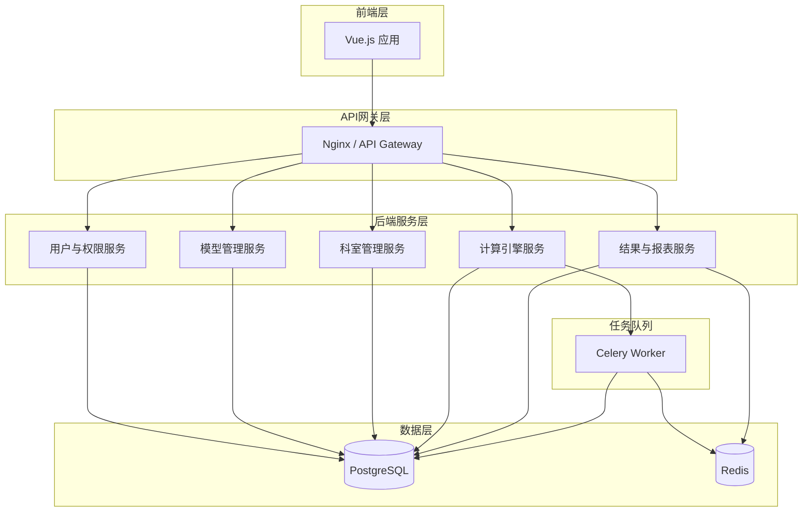

# 医院科室业务价值评估工具 - 系统设计文档 V1.0

> **文档状态**: 草稿
> **创建日期**: 2025-10-20
> **版本**: 1.0

---

## 1. 设计概述

### 1.1. 设计原则
本系统设计遵循以下核心原则：
-   **高内聚，低耦合**：各模块功能明确，模块间通过定义良好的接口进行通信，减少相互依赖。
-   **可扩展性**：系统设计应易于扩展新的计算逻辑、维度类型或报表格式。
-   **可维护性**：代码结构清晰，文档齐全，便于后续维护和升级。
-   **安全性**：严格的数据权限控制，确保数据安全。

### 1.2. 技术栈选型
-   **前端**: Vue.js 3 + Element Plus (提供丰富的表格和表单组件，适合管理后台风格)
-   **后端**: Python 3.9 + FastAPI (高性能、现代化的Web框架，自带API文档)
-   **数据库**: PostgreSQL 14 (强大的关系型数据库，支持复杂查询)
-   **任务队列**: Celery + Redis (处理异步计算和报表生成任务)
-   **缓存**: Redis (缓存热点数据，提高查询性能)

---

## 2. 系统总体架构

系统采用前后端分离的微服务化架构，主要划分为以下几个核心模块：

### 2.1. 模块职责划分

| 模块 | 职责 | 核心功能 |
|---|---|---|
| **用户与权限服务** | 管理用户、角色及权限 | 用户登录、RBAC权限控制、数据权限隔离 |
| **模型管理服务** | 管理评估模型的所有相关数据 | 模型版本CRUD、树状结构CRUD、维度目录管理、SQL/Python脚本管理 |
| **科室管理服务** | 管理科室信息及评估范围 | 科室对照关系维护、评估范围启用/禁用 |
| **计算引擎服务** | 执行业务价值计算任务 | 任务调度、SQL/Python执行、结果计算与存储 |
| **结果与报表服务** | 提供结果查询、展示和导出 | 结果查询、在线展示、Excel报表生成与下载 |

---

## 3. 详细模块设计

### 3.1. 用户与权限服务 (Auth Service)

#### 3.1.1. 功能设计
-   **登录认证**: 提供用户名/密码登录接口，返回JWT Token。
-   **角色管理**: 支持增删改查角色，并为角色分配菜单权限（按钮级权限控制）。
-   **用户管理**: 支持增删改查用户，并为用户分配角色。
-   **数据权限**: 在用户登录后，根据其角色动态生成数据权限SQL（如 `WHERE kdksid IN ('ks001', 'ks002')`），并在所有数据查询接口中应用。

#### 3.1.2. 接口设计 (RESTful)
-   `POST /auth/login`: 用户登录
-   `GET /users`: 获取用户列表
-   `POST /users`: 创建用户
-   `PUT /users/{id}`: 更新用户
-   `GET /roles`: 获取角色列表
-   `POST /roles`: 创建角色
-   `PUT /roles/{id}`: 更新角色

### 3.2. 模型管理服务 (Model Service)

#### 3.2.1. 功能设计
-   **模型版本管理**: 独立的模型版本CRUD，支持复制、设为活动版本。
-   **模型结构管理**: 提供类似Excel的表格化编辑界面，支持多层级节点的增删改。
-   **维度目录管理**: 为“统计型”维度提供独立的收费项目配置界面，支持搜索、批量导入导出。
-   **代码管理**: 为“计算型”维度提供SQL/Python代码编辑器和测试运行功能。

#### 3.2.2. 接口设计 (RESTful)
-   `GET /model-versions`: 获取模型版本列表
-   `POST /model-versions`: 创建新模型版本
-   `PUT /model-versions/{id}/activate`: 激活模型版本
-   `GET /model-nodes?version_id={id}`: 获取指定版本的模型结构
-   `POST /model-nodes`: 创建模型节点
-   `PUT /model-nodes/{id}`: 更新模型节点
-   `DELETE /model-nodes/{id}`: 删除模型节点
-   `GET /dimension-items?dimension_id={id}`: 获取维度的收费项目目录
-   `POST /dimension-items`: 为维度添加收费项目
-   `DELETE /dimension-items/{id}`: 删除维度关联的收费项目
-   `POST /dimension-items/import`: 批量导入维度目录
-   `POST /model-nodes/{id}/test-code`: 测试节点代码

### 3.3. 科室管理服务 (Dept Service)

#### 3.3.1. 功能设计
-   **科室列表展示**: 以表格形式展示所有科室的对照信息。
-   **对照关系编辑**: 支持在线编辑成本中心、核算单元等信息。
-   **评估范围控制**: 提供开关，控制科室是否参与计算。

#### 3.3.2. 接口设计 (RESTful)
-   `GET /departments`: 获取科室列表
-   `PUT /departments/{id}`: 更新科室信息
-   `PUT /departments/{id}/toggle-evaluation`: 切换科室评估状态

### 3.4. 计算引擎服务 (Calculation Service)

#### 3.4.1. 功能设计
-   **任务创建**: 接收前端发起的计算请求，创建计算任务并放入队列。
-   **任务执行**: Celery Worker从队列中获取任务，根据模型版本和科室范围执行计算。
-   **逻辑处理**: 区分“统计型”和“计算型”维度，采用不同方式获取工作量数据。
-   **结果存储**: 将计算过程的中间结果和最终结果存入数据库。

#### 3.4.2. 接口设计 (RESTful)
-   `POST /calculation/tasks`: 创建并启动计算任务
-   `GET /calculation/tasks`: 获取计算任务列表
-   `GET /calculation/tasks/{id}/log`: 获取任务日志

### 3.5. 结果与报表服务 (Result Service)

#### 3.5.1. 功能设计
-   **结果查询**: 提供多维度筛选（时间、模型、科室）的结果查询接口。
-   **在线展示**: 将查询结果格式化为前端需要的结构，用于绩效结构表和汇总表的展示。
-   **报表生成**: 接收导出请求，生成异步任务，生成Excel文件并提供下载链接。

#### 3.5.2. 接口设计 (RESTful)
-   `GET /results/summary`: 获取科室汇总数据
-   `GET /results/detail?dept_id={id}&task_id={id}`: 获取科室详细绩效数据
-   `POST /results/export/summary`: 导出汇总表
-   `POST /results/export/detail`: 导出明细表
-   `GET /results/export/{task_id}/download`: 下载报表文件

---

## 4. 数据库设计

### 4.1. 核心表结构设计

#### 4.1.1. 用户与权限
-   `users`: 用户表
-   `roles`: 角色表
-   `user_roles`: 用户角色关联表
-   `permissions`: 权限表
-   `role_permissions`: 角色权限关联表

#### 4.1.2. 模型管理
-   `model_versions`: 模型版本表
-   `model_nodes`: 模型节点表 (存储树状结构)
-   `dimension_item_mapping`: 维度-收费项目映射表

#### 4.1.3. 计算与结果
-   `calculation_tasks`: 计算任务表
-   `calculation_results`: 计算结果明细表
-   `calculation_summaries`: 计算结果汇总表

#### 4.1.4. 系统配置
-   `system_settings`: 系统设置表 (如当期年月)
-   `departments`: 科室信息扩展表 (存储是否参与评估等状态)

### 4.2. 关键表字段设计

##### `model_nodes` (模型节点表)
| 字段名 | 类型 | 描述 |
|---|---|---|
| id | SERIAL | 主键 |
| version_id | INT | 模型版本ID (外键) |
| parent_id | INT | 父节点ID (外键, 自关联) |
| name | VARCHAR(255) | 节点名称 |
| code | VARCHAR(100) | 节点编码 |
| node_type | VARCHAR(50) | 节点类型 (sequence/dimension) |
| calc_type | VARCHAR(50) | 计算类型 (statistical/calculational) |
| weight | NUMERIC(10, 4) | 权重/单价 |
| business_guide | TEXT | 业务导向 |
| script | TEXT | SQL/Python脚本 |
| created_at | TIMESTAMP | 创建时间 |
| updated_at | TIMESTAMP | 更新时间 |

##### `dimension_item_mapping` (维度-收费项目映射表)
| 字段名 | 类型 | 描述 |
|---|---|---|
| id | SERIAL | 主键 |
| dimension_id | INT | 维度节点ID (外键) |
| item_code | VARCHAR(100) | 收费项目编码 |
| created_at | TIMESTAMP | 创建时间 |

---

## 5. UI原型设计

### 5.1. 整体布局
采用经典的后台管理布局：
-   **顶部导航栏**: Logo、面包屑导航、用户信息下拉菜单。
-   **左侧菜单栏**: 根据用户权限动态生成的功能菜单。
-   **主内容区**: 展示各功能页面。

### 5.2. 关键页面原型

#### 5.2.1. 登录页
-   居中登录表单。
-   用户名、密码输入框。
-   登录按钮。

#### 5.2.2. 模型管理 - 模型列表页
-   页面标题: "评估模型管理"
-   操作按钮: "新建版本"
-   表格:
    -   列: 版本号、版本名称、创建时间、是否活动、操作
    -   操作列: "设为活动"、"编辑结构"、"复制"、"删除"
-   分页组件。

#### 5.2.3. 模型管理 - 结构编辑页
-   页面标题: "编辑模型结构 - [版本名称]"
-   左侧: 类似Excel的表格，展示模型树状结构。
    -   列: 节点名称、节点编码、节点类型、计算类型、权重/单价、业务导向、操作
    -   支持行内编辑和新增/删除行。
-   右侧 (或下方): 节点详情编辑面板。
    -   当选中“计算型”维度时，显示代码编辑器和“测试运行”按钮。
    -   当选中“统计型”维度时，显示“配置收费项目”按钮。

#### 5.2.4. 模型管理 - 维度目录配置页 (弹窗/新页)
-   页面标题: "配置维度目录 - [维度名称]"
-   上方: 搜索框，用于搜索收费项目。
-   中间: 已关联的收费项目列表，支持删除。
-   下方: 搜索结果列表，支持添加。
-   操作按钮: "导入目录"、"导出目录"。

#### 5.2.5. 科室管理页
-   页面标题: "科室管理"
-   表格:
    -   列: HIS科室代码、HIS科室名称、成本中心代码、成本中心名称、核算单元名称、是否参与评估、操作
    -   "是否参与评估"列: 使用Switch开关组件。
    -   操作列: "编辑"
-   支持按科室名称搜索。

#### 5.2.6. 计算任务页
-   页面标题: "计算任务"
-   操作区:
    -   下拉选择: "模型版本"
    -   下拉选择: "科室范围" (全部科室/指定科室)
    -   按钮: "开始计算"
-   表格:
    -   列: 任务ID、模型版本、计算周期、状态、创建时间、完成时间、操作
    -   状态列: 使用Tag组件显示 (排队中/运行中/已完成/失败)
    -   操作列: "查看日志"、"重试" (失败时)

#### 5.2.7. 结果查询页 - 汇总视图
-   页面标题: "业务价值汇总"
-   筛选区:
    -   下拉选择: "评估月份"
    -   下拉选择: "模型版本"
-   表格:
    -   列: 科室、医生价值、医生占比、护理价值、护理占比、医技价值、医技占比、科室总价值...
    -   最后一行: "全院汇总"
-   操作按钮: "导出Excel"

#### 5.2.8. 结果查询页 - 明细视图
-   点击汇总表的某一行“科室”进入。
-   页面标题: "[科室名称] - 绩效结构表"
-   Tab页: "医生序列"、"护理序列"、"医技序列"
-   每个Tab内是一个可折叠的表格，结构与Excel模板一致。
-   操作按钮: "导出Excel"

---

## 6. 部署架构

### 6.1. 服务器规划
-   **Web服务器**: 1台，部署Nginx和前端静态文件。
-   **应用服务器**: 1-2台，部署Python后端服务。
-   **数据库服务器**: 1台，部署PostgreSQL主库。
-   **缓存/队列服务器**: 1台，部署Redis。

### 6.2. 部署流程
1.  前端项目构建后，将静态文件部署到Nginx。
2.  后端服务通过Docker容器化部署，由进程管理器（如Supervisor）管理。
3.  Celery Worker作为独立服务运行。
4.  Nginx配置反向代理，将API请求转发到后端服务。

---

## 7. 附录

### 7.1. 待定事项
-   Excel报表生成的具体技术选型 (如 `openpyxl` 或 `xlsxwriter`)。
-   大数据量下的计算性能优化策略 (如分科室并行计算)。

### 7.2. 风险与应对
-   **风险**: 复杂SQL或Python脚本执行可能存在性能瓶颈或安全风险。
-   **应对**: 对脚本执行进行超时限制和资源隔离；对SQL进行语法分析，禁止危险操作。